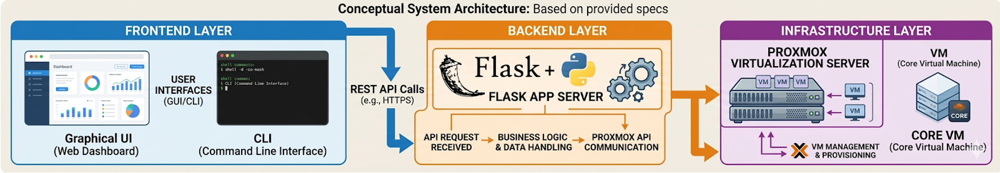
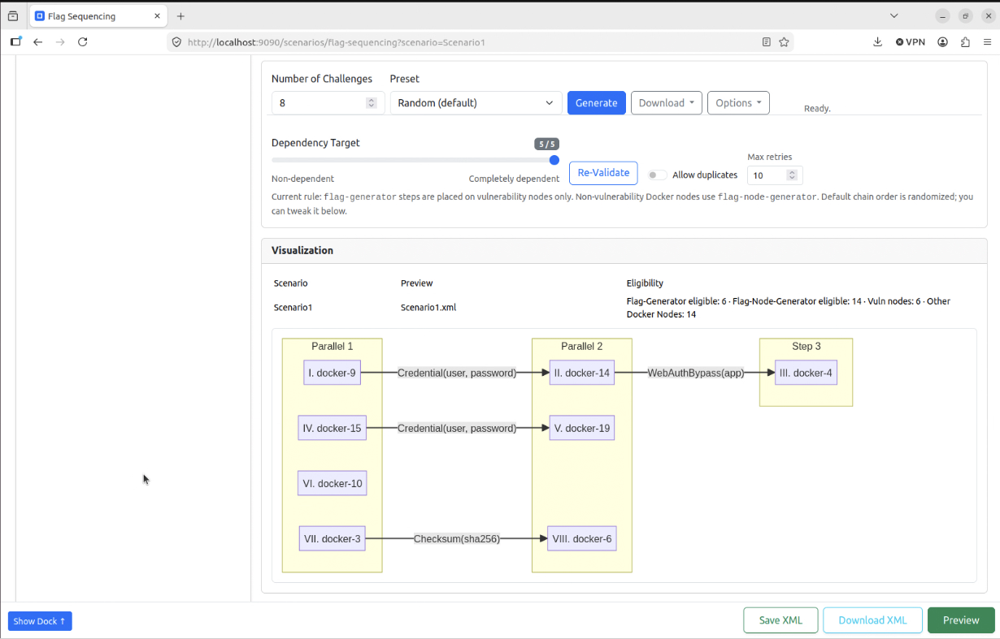

# ScenarioForge

Generate reproducible CORE network topologies from scenario XML files using a rich Web GUI or a command-line interface.

## Table of contents
- [Highlights](#highlights)
- [Screenshots](docs/screenshots.md)
- [VM-mode setup](#vm-mode-setup-recommended)
- [Other operating modes](#other-operating-modes)
- [Quick start](docs/QUICK_START.md)
- [Full Preview workflow](docs/FULL_PREVIEW_WORKFLOW.md)
- [Feature deep dive](docs/FEATURE_DEEP_DIVE.md)
- [Architecture overview](docs/ARCHITECTURE_OVERVIEW.md)
- [Restrictions & limitations](docs/RESTRICTIONS_LIMITATIONS.md)
- [Troubleshooting](docs/TROUBLESHOOTING.md)
- [Additional documentation](#additional-documentation)
- [Contributing](#contributing)

## Highlights
- **Scenario creation with real backend assets** – turn an idea into a runnable CORE topology with routers, hosts, Docker-backed vulnerability targets, traffic, segmentation, reports, and downloadable exercise artifacts.
- **As much or as little specificity as you want** – start from a broad goal, a classroom exercise prompt, or a detailed XML plan; refine node counts, services, routing, vulnerabilities, HITL attachments, and flag sequencing only when you care about those details.
- **Built for practice and instruction** – use ScenarioForge to train yourself, run classroom labs, rehearse cyber ranges, prototype network-defense scenarios, or experiment with attack/defense workflows without rebuilding the lab by hand each time.
- **VM-mode first for realistic labs** – run ScenarioForge as the control application for a Proxmox-hosted CORE 9.2 VM and a participant machine such as Kali, with CORE gRPC, SSH validation, and HITL bridge workflows tied into the UI.
- **Preview before execution** – inspect topology graphs, challenge chains, vulnerability placement, node roles, and generated artifacts before starting the CORE session.
- **Reproducible runs** – optional RNG seeds, XML scenario files, saved plans, Markdown reports, and JSON summaries make labs repeatable for students, operators, and future experiments.

## Screenshots

<div align="center">
	<table>
		<tr>
			<td width="50%" align="center">
				
			</td>
			<td width="50%" align="center">
				
			</td>
		</tr>
		<tr>
			<td align="center"><em>Conceptual system architecture.</em></td>
			<td align="center"><em>Flag sequencing challenge flow.</em></td>
		</tr>
	</table>
</div>

View the WebUI images gallery [`docs/screenshots.md`](docs/screenshots.md).

## VM-Mode Setup (Recommended)

ScenarioForge supports both **VM mode** and **native mode**. The README focuses on VM mode because it matches the intended Proxmox lab workflow: ScenarioForge runs as the control application, talks to a CORE 9.2 VM over gRPC/SSH, and can prepare participant-facing HITL attachments.

For native/non-VM operation, including autodetected local CORE, explicit remote CORE targets without Proxmox, Docker-only notes, and CLI usage, see [docs/OPERATING_MODES.md](docs/OPERATING_MODES.md).

### Recommended Lab Layout

Use three machines or clearly separated VM roles when possible:

1. **ScenarioForge application host** – runs this repository, the Web UI, and optional Docker Compose/nginx wrapper.
2. **CORE 9.2 machine** – usually a Proxmox VM with CORE 9.2, `core-daemon`, SSH access, and Docker if vulnerability compose targets are used.
3. **Participant machine** – a Kali VM or physical participant host attached through HITL to the generated exercise network.

The Proxmox server manages the CORE VM and participant VM/interface plumbing. In VM mode, ScenarioForge uses CORE gRPC for topology/session control, SSH for remote setup and validation, and Proxmox bridge workflows when you apply HITL wiring from the UI.

### Configure VM Mode

Copy the committed defaults and edit the local override file:

```bash
cp .scenarioforge.env.example .scenarioforge.env
```

The local `.scenarioforge.env` file is gitignored. Docker Compose and direct Python launches both read `.scenarioforge.env` when present; otherwise the application uses built-in defaults. `.scenarioforge.env.example` is a versioned template and is not loaded automatically at runtime. Real environment variables take precedence over file-based values.

Key runtime variables in [.scenarioforge.env.example](.scenarioforge.env.example):

- `CORE_HOST` / `CORE_PORT` – CORE gRPC endpoint for the CORE 9.2 VM, commonly `<core-vm-ip>:50051`.
- `CORE_SSH_HOST` / `CORE_SSH_PORT` – SSH target used for remote setup, validation, file checks, and service operations. Usually the same host as `CORE_HOST`.
- `CORE_SSH_USERNAME` / `CORE_SSH_PASSWORD` – SSH credentials for the CORE VM. Use local secrets or environment overrides for real deployments.
- `CORETG_WEBUI_MODE` – set this to `vm` to pre-seed VM-oriented UI behavior and VM-mode HITL defaults.
- `CORETG_HITL_CORE_IFX_IPV4` – optional IPv4 or CIDR to pre-seed on a HITL interface entry in either mode, such as `10.254.200.3/24`. In native mode it only fills the first existing HITL interface entry that does not already define an IPv4 value; it does not create a HITL interface or enable HITL by itself. In VM mode it also populates the runtime-managed HITL default interface, but that interface still requires `CORETG_VM_MODE_HITL_CORE_IFX_NAME` to be configured.
- `CORETG_VM_MODE_HITL_ENABLED` – enables participant-facing HITL defaults in VM mode.
- `CORETG_VM_MODE_HITL_CORE_IFX_NAME` – expected Linux interface name inside the CORE VM for the participant network, such as `ens18`.
- `CORETG_VM_MODE_HITL_CORE_IFX_ATTACHMENT` – default HITL attachment target for that VM-mode interface: `existing_router`, `existing_switch`, `new_router`, or `proxmox_vm`.
- `CORETG_VM_MODE_HITL_CORE_IFX_DESCRIPTION` – optional label/description applied to that VM-mode HITL interface entry.
- `CORETG_VM_MODE_PARTICIPANT_URL` – optional participant UI URL shown in VM-mode flows.

Minimum VM-mode override example:

```dotenv
CORE_HOST=10.0.0.50
CORE_PORT=50051
CORE_SSH_HOST=10.0.0.50
CORE_SSH_PORT=22
CORE_SSH_USERNAME=corevm
CORE_SSH_PASSWORD=change-me
CORETG_WEBUI_MODE=vm
CORETG_VM_MODE_HITL_ENABLED=true
CORETG_VM_MODE_HITL_CORE_IFX_NAME=ens18
CORETG_VM_MODE_HITL_CORE_IFX_ATTACHMENT=existing_router
CORETG_HITL_CORE_IFX_IPV4=10.254.200.3/24
```

### Run the Web UI

Recommended HTTPS/Compose launch:

```bash
docker compose up -d --build
```

- Open `https://localhost` and verify health with `curl -k https://localhost/healthz`.
- The backend is also published at `http://localhost:9090` for direct health checks and local development.
- Compose and direct Python launches both use `.scenarioforge.env` for local runtime overrides.
- The Docker image includes Graphviz, so attack graph PDF export works in Compose-based runs.
- Compose publishes nginx on `80/443` and the web backend on `127.0.0.1:9090`. In native Docker bridge mode, container-local CORE targets such as `127.0.0.1` are treated as `host.docker.internal`; in VM mode, `127.0.0.1` is preserved because it means core-daemon on the remote CORE host reached over SSH. Set `CORETG_KEEP_CONTAINER_LOCAL_CORE=1` only when CORE really runs inside the web container.

Direct Python launch for development:

```bash
uv sync --extra dev
uv run python webapp/app_backend.py
```

After launch, use the CORE Management and Execute views to validate CORE connectivity, save VM/Proxmox credentials, apply participant bridge wiring, preview the scenario, and execute it.

### DeployForge

A ready-to-deploy DeployForge file is coming soon: [docs/DEPLOYFORGE.md](docs/DEPLOYFORGE.md).

## Other Operating Modes

Native mode is the non-VM application mode. It can talk to CORE on the same machine or to an explicit remote CORE host; when CORE is local and no `CORE_HOST` override is set, the auto launcher/default config uses the local CORE endpoint so you do not need a separate mode switch. Native mode is useful for local development, quick CLI checks, and non-Proxmox labs, but it does not mirror the participant/CORE VM separation used by VM mode.

See [docs/OPERATING_MODES.md](docs/OPERATING_MODES.md) for native mode with local or remote CORE targets, direct Python launches, Docker Compose notes, and CLI commands.

## Guides
- [Operating modes](docs/OPERATING_MODES.md)
- [Quick start](docs/QUICK_START.md)
- [Full Preview workflow](docs/FULL_PREVIEW_WORKFLOW.md)
- [Feature deep dive](docs/FEATURE_DEEP_DIVE.md)
- [Architecture overview](docs/ARCHITECTURE_OVERVIEW.md)
- [Restrictions & limitations](docs/RESTRICTIONS_LIMITATIONS.md)
- [Troubleshooting](docs/TROUBLESHOOTING.md)

## Additional documentation
- [docs/README.md](docs/README.md) – Index of project documentation pages
- [docs/reference/API.md](docs/reference/API.md) – REST endpoints exposed by the Web UI backend
- Flag Sequencing (Flow) endpoints and Attack Flow Builder `.afb` export are documented in [docs/reference/API.md](docs/reference/API.md) and the OpenAPI spec at [`docs/openapi.yaml`](docs/openapi.yaml).
- Participant UI selection behavior is deterministic: incoming `?scenario=...` selection is prioritized, then remembered last selection, then the first listed scenario.
- Generator authoring (flag-generators and flag-node-generators) is documented in [docs/GENERATOR_AUTHORING.md](docs/GENERATOR_AUTHORING.md).
	- Generator catalogs are imported as ZIP packs from the Flag Catalog page and installed under `outputs/installed_generators/`.
	- This repo does not ship a starter generator catalog; use [generator_templates](generator_templates) when authoring new packs.
- AI prompt templates for generator authoring (copy/paste) are in [docs/AI_PROMPT_TEMPLATES.md](docs/AI_PROMPT_TEMPLATES.md).
- The reusable generator prompt context lives at [docs/prompts/prompt_sample_context_generator.txt](docs/prompts/prompt_sample_context_generator.txt).
- Vulnerability data source: This project uses docker images and payloads from the [Vulhub project](https://github.com/vulhub/vulhub) for vulnerability demonstrations. Vulhub images are pulled on demand during execution.
- For generator reliability, validate both UI Test and full Execute paths (remote CORE runtime). See the Test/Execute parity checklist in [docs/GENERATOR_AUTHORING.md](docs/GENERATOR_AUTHORING.md).
- Execute validation now exposes downloadable per-issue logs via `validation_summary.error_logs` in `run_status` (documented in [docs/reference/API.md](docs/reference/API.md)).
- Async run polling note: `GET /run_status/<run_id>` returns `404` for unknown/stale run ids; clients should treat this as terminal and stop polling.
- [docs/reference/SCENARIO_XML_SCHEMA.md](docs/reference/SCENARIO_XML_SCHEMA.md) – Schema walkthrough and examples

## Runtime validation
- Execute and CLI runs perform runtime validation as part of the run lifecycle.
- Web runs expose the latest validation payload at `GET /run_status/<run_id>` as `validation_summary` while the run is retained in memory.
- Reports persist validation details in the Markdown/JSON report artifacts under `./reports/` and in run history entries.
- A healthy strict validation has `validation_summary.ok == true` and zero issue counters such as `missing_nodes`, `docker_not_running`, `injects_missing`, `generator_outputs_missing`, and `generator_injects_missing`.

## Contributing
Pull requests and issue reports are welcome! Please run the relevant pytest targets (`pytest -q`) before submitting changes and keep documentation up to date when behaviour changes.

If using uv, run tests with:
```bash
uv run pytest -q
```