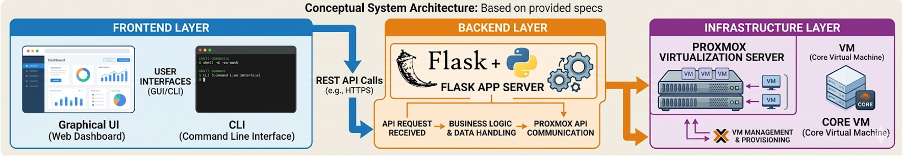
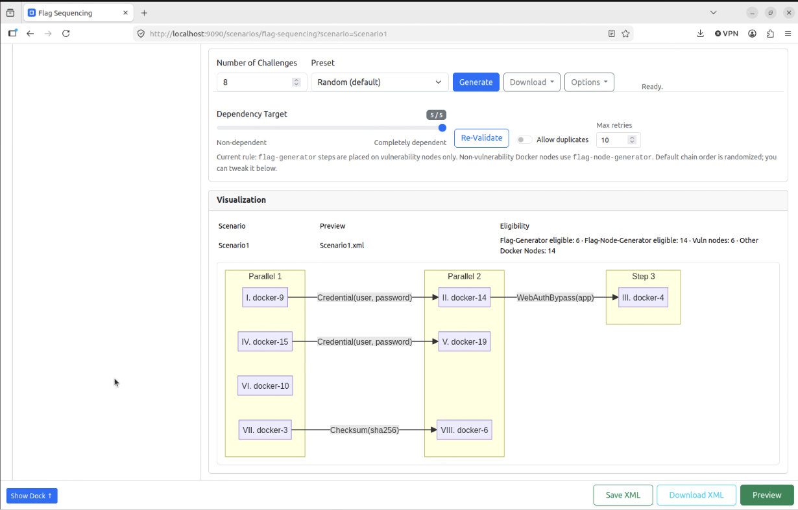

# ScenarioForge

Generate reproducible CORE network topologies from scenario XML files using a rich Web GUI or a command-line interface.

The scenario Import action detects both ordinary XML and ScenarioForge reproduction
bundles by file content. Bundle imports validate their manifest and SHA-256 hashes,
restore any included artifact sources, rewrite the saved Flow paths to the restored
locations, and otherwise retain the saved resolved inputs for deterministic artifact
regeneration. Supported bundle filenames may use `.zip` or `.scenarioforge` in
addition to the existing `.xml` import.

Import displays live upload, validation, extraction, mode-selection,
materialization, verification, and editor-loading steps. When a bundle contains
artifact payloads, native mode with local CORE restores them directly under the
guarded `/tmp/vulns/` artifact roots without credentials. Native mode with a
remote CORE target and VM mode both connect over SSH using ScenarioForge's
current runtime `CORE_*` configuration or a destination-owned validated
VM/Access profile. Credentials in the imported XML or bundle are deliberately
ignored for automatic materialization and are never displayed in the progress
log. Import collects only missing CORE host/port and SSH host/port/username/
password fields, validates SSH and SFTP before upload, and then replaces source
connection metadata in the imported XML with the destination's non-secret
connection and profile metadata. A password entered during import is used only
by that request unless the user selects **Save encrypted destination access
profile for later Generate/Run**. With that explicit option, it is encrypted in
ScenarioForge's existing destination secret store and the XML receives only the
profile identifier; it is never written to the progress state. Note that an
exported reproduction bundle does carry its own source scenario's CORE
credentials so imports can reach a host without re-entering them, which makes a
bundle a secret-bearing file — share one only with people you would give that
CORE host's password.
If preflight validation fails, upload waits and the
connection form remains available for correction. If CORE becomes unavailable
after validation, the scenario still imports without its artifacts; re-import
the bundle to retry.
Importing a bundle asks whether to materialize its artifacts onto the CORE
host. Materializing makes the scenario immediately executable but is the
slowest part of an import; declining keeps the import quick and leaves the
artifacts to be regenerated on the next execute. Either choice reports its
progress in the import dialog.
Replay-only packages and plain XML do not run generators during import.

## Table of contents
- [Highlights](#highlights)
- [Screenshots](docs/screenshots.md)
- [VM-mode setup](#vm-mode-setup-recommended)
- [Proxmox three-VM installer](scripts/proxmox/README.md) — graphical XFCE guests, a browser, native ScenarioForge, and optional generator/Vulhub catalogs
- [VMware Workstation Linux three-VM installer](scripts/vmware-workstation/README.md) — the same graphical lab and optional catalogs on an x86_64 Linux desktop
- [VMware Fusion macOS three-VM installer](scripts/vmware-fusion/README.md) — the graphical lab on Intel or Apple silicon Macs, with architecture-matched Debian/Ubuntu guests
- [Other operating modes](#other-operating-modes)
- [CORE install](docs/CORE_INSTALL.md)
- [Quick start](docs/QUICK_START.md)
- [CLI execution deep dive](docs/CLI_EXECUTION_DEEP_DIVE.md)
- [Catalog batch testing](docs/CATALOG_BATCH_TESTING.md)
- [Evaluator compatibility contract](docs/SCENARIOFORGE_EVAL_COMPATIBILITY.md)
- [Full Preview workflow](docs/FULL_PREVIEW_WORKFLOW.md)
- [Feature deep dive](docs/FEATURE_DEEP_DIVE.md)
- [Architecture overview](docs/ARCHITECTURE_OVERVIEW.md)
- [Restrictions & limitations](docs/RESTRICTIONS_LIMITATIONS.md)
- [Troubleshooting](docs/TROUBLESHOOTING.md)
- [Additional documentation](#additional-documentation)
- [Contributing](#contributing)

## Highlights
- **Scenario creation with real backend assets** – turn an idea into a runnable CORE topology with routers, hosts, Docker-backed vulnerability targets, traffic, segmentation, reports, and downloadable exercise artifacts.
- **As much or as little specificity as you want** – start from a broad goal, a classroom exercise prompt, or a detailed XML plan; refine node counts, services, routing, vulnerabilities, HITL attachments, and flag sequencing only when you care about those details.
- **Built for practice and instruction** – use ScenarioForge to train yourself, run classroom labs, rehearse cyber ranges, prototype network-defense scenarios, or experiment with attack/defense workflows without rebuilding the lab by hand each time.
- **VM-mode first for realistic labs** – run ScenarioForge as the control application for a Proxmox-hosted CORE 9.2 VM and a participant machine such as Kali, with CORE gRPC, SSH validation, and HITL bridge workflows tied into the UI.
- **Preview before execution** – inspect topology graphs, challenge chains, vulnerability placement, node roles, and generated artifacts before starting the CORE session.
- **Catalog checks before execution** – batch-test vulnerability catalog items, flag-generators, and flag-node-generators from the CLI before starting a full scenario Execute run.
- **Artifact checks after execution** – validate a running session in place: containers on the right nodes, services up, ports reachable across the CORE network, injects delivered, segmentation enforced, traffic running, and nodes reachable. Available as a per-session button on the CORE page and as the `check-artifacts` CLI phase.
- **Verify the challenges are solvable** – download a **Solutions Script** from the Reports page that walks the resolved attack chain, retrieves each flag, and reports pass/fail per step.
- **Reproducible runs** – optional RNG seeds, XML scenario files, saved plans, Markdown reports, and JSON summaries make labs repeatable for students, operators, and future experiments.

## Screenshots

<div align="center">
	<table>
		<tr>
			<td width="50%" align="center">
				
			</td>
			<td width="50%" align="center">
				
			</td>
		</tr>
		<tr>
			<td align="center"><em>Conceptual system architecture.</em></td>
			<td align="center"><em>Flag sequencing challenge flow.</em></td>
		</tr>
	</table>
</div>

View the WebUI images gallery [`docs/screenshots.md`](docs/screenshots.md).

## VM-Mode Setup (Recommended)

ScenarioForge supports both **VM mode** and **native mode**. The README focuses on VM mode because it matches the intended lab workflow: ScenarioForge runs as the control application, talks to a CORE 9.2 VM over gRPC/SSH, and can prepare participant-facing HITL attachments.

**VM mode does not require Proxmox.** A host running ScenarioForge, a CORE VM, and a Kali VM is a complete lab, on whichever hypervisor you already use. Proxmox is only needed for the UI's optional automated HITL bridge wiring; elsewhere you create the participant network in your own hypervisor.

For native/non-VM operation, including autodetected local CORE, explicit remote CORE targets, Docker-only notes, and CLI usage, see [docs/OPERATING_MODES.md](docs/OPERATING_MODES.md).

Full step-by-step setup guides:

- [docs/CORE_INSTALL.md](docs/CORE_INSTALL.md) – install CORE from our fork ([github.com/raistlinJ/core](https://github.com/raistlinJ/core)), which ships the fixes and updates ScenarioForge depends on — most easily via the [coreemu-minimal](https://github.com/raistlinJ/coreemu-minimal) installer — or apply those updates to a vanilla CORE install.
- [docs/VM_MODE_SETUP.md](docs/VM_MODE_SETUP.md) – building the CORE VM, the three-interface layout (management, HITL/participant, uplink), wiring the three machines on any hypervisor, and the complete VM-mode `.scenarioforge.env` reference.
- [scripts/proxmox/README.md](scripts/proxmox/README.md) – provision the complete graphical CORE, browser-equipped native ScenarioForge, and XFCE participant VM layout from a Proxmox shell; optional flags install the private generator and Vulhub catalogs.
- [scripts/vmware-workstation/README.md](scripts/vmware-workstation/README.md) – provision the same three graphical VMs and optional catalogs with VMware Workstation on an x86_64 Linux host.
- [scripts/vmware-fusion/README.md](scripts/vmware-fusion/README.md) – provision the same lab with VMware Fusion on Intel or Apple silicon macOS hosts.
- [docs/NATIVE_MODE_SETUP.md](docs/NATIVE_MODE_SETUP.md) – local and remote CORE targets, the native-mode `.scenarioforge.env` reference, and the Proxmox **VM / Access** workflow (credentials, required API privileges, CORE VM selection, HITL bridge apply).

### Recommended Lab Layout

Use three machines or clearly separated VM roles when possible:

1. **ScenarioForge application host** – runs this repository, the Web UI, and optional Docker Compose/nginx wrapper. A workstation or laptop is fine; it does not have to be a VM.
2. **CORE 9.2 machine** – a VM with CORE 9.2, `core-daemon`, SSH access, and Docker if vulnerability compose targets are used. Install CORE from **our fork**, [github.com/raistlinJ/core](https://github.com/raistlinJ/core), which already carries the fixes and updates ScenarioForge depends on; the [coreemu-minimal](https://github.com/raistlinJ/coreemu-minimal) installer builds this VM from a minimal Debian 12 install and brings Docker and the routing daemons with it. With upstream/vanilla CORE you must apply those updates yourself, as described in [docs/CORE_INSTALL.md](docs/CORE_INSTALL.md).
3. **Participant machine** – a Kali VM or physical participant host attached through HITL to the generated exercise network.

Two networks connect them: a management network between the application host and the CORE VM, and an isolated participant network between the CORE VM and the participant machine. In VM mode, ScenarioForge uses CORE gRPC for topology/session control and SSH for remote setup and validation; Proxmox bridge workflows come into play only if you apply HITL wiring from the UI on a Proxmox-hosted lab.

### Configure VM Mode

Copy the committed defaults and edit the local override file:

```bash
cp .scenarioforge.env.example .scenarioforge.env
```

The local `.scenarioforge.env` file is gitignored. Docker Compose and direct Python launches both read `.scenarioforge.env` when present; otherwise the application uses built-in defaults. `.scenarioforge.env.example` is a versioned template and is not loaded automatically at runtime. Real environment variables take precedence over file-based values.

Key runtime variables in [.scenarioforge.env.example](.scenarioforge.env.example):

- `CORE_HOST` / `CORE_PORT` – CORE gRPC endpoint for the CORE 9.2 VM, commonly `<core-vm-ip>:50051`.
- `CORE_SSH_HOST` / `CORE_SSH_PORT` – SSH target used for remote setup, validation, file checks, and service operations. Usually the same host as `CORE_HOST`.
- `CORE_SSH_USERNAME` / `CORE_SSH_PASSWORD` – SSH credentials for the CORE VM. Use local secrets or environment overrides for real deployments.
- `CORETG_WEBUI_MODE` – set this to `vm` to pre-seed VM-oriented UI behavior and VM-mode HITL defaults.
- `CORETG_HITL_CORE_IFX_IPV4` – optional IPv4 or CIDR to pre-seed on a HITL interface entry in either mode, such as `10.254.200.3/24`. In native mode it only fills the first existing HITL interface entry that does not already define an IPv4 value; it does not create a HITL interface or enable HITL by itself. In VM mode it also populates the runtime-managed HITL default interface, but that interface still requires `CORETG_VM_MODE_HITL_CORE_IFX_NAME` to be configured.
- `CORETG_VM_MODE_HITL_ENABLED` – enables participant-facing HITL defaults in VM mode.
- `CORETG_VM_MODE_HITL_CORE_IFX_NAME` – expected Linux interface name inside the CORE VM for the participant network, such as `ens19`. It must be a physical/virtio NIC as the guest sees it, named by guest interface name rather than the hypervisor's slot id. See [docs/VM_MODE_SETUP.md](docs/VM_MODE_SETUP.md#3-core-vm-network-interfaces).
- `CORETG_VM_MODE_HITL_CORE_IFX_ATTACHMENT` – default HITL attachment target for that VM-mode interface: `existing_router`, `existing_switch`, `new_router`, or `proxmox_vm`.
- `CORETG_VM_MODE_HITL_CORE_IFX_DESCRIPTION` – optional label/description applied to that VM-mode HITL interface entry.
- `CORETG_VM_MODE_PARTICIPANT_URL` – optional participant UI URL shown in VM-mode flows.
- `CORETG_FLOW_SEQUENCE_TIMEOUT_S` – minimum browser-side timeout (seconds, default `300`) for the Flag Sequencing **Sequence** step.
- `CORETG_FLOW_EXECUTE_TIMEOUT_S` – upper cap (seconds, default `3600`) on the browser-side timeout for the Flag Sequencing **Resolve** step, which scales with chain length up to this value.
- `CORETG_NGINX_PROXY_READ_TIMEOUT_S` – nginx `proxy_read_timeout` (seconds, default `3700`) for the Docker Compose deployment only. Keep it at or above `CORETG_FLOW_EXECUTE_TIMEOUT_S` so nginx doesn't cut a long Resolve/Execute request before the browser's own timeout would. Not used for direct Python launches.
- `CORETG_AI_PROVIDER` / `CORETG_AI_MODEL` / `CORETG_AI_BASE_URL` – AI provider wiring for scenario generation. The Web UI keeps these in browser state; setting them here is what lets the `ai` CLI phase (and any scripted request) generate without the browser.
- `CORETG_AI_API_KEY_USER` – username whose stored provider credential supplies the API key. Prefer this over `CORETG_AI_API_KEY`, which puts the key in a plaintext file instead of the encrypted per-user credential store.
- `CORETG_AI_BRIDGE_MODE` / `CORETG_AI_MCP_SERVER_PATH` / `CORETG_AI_TIMEOUT_S` / `CORETG_AI_VERIFY_SSL` – optional overrides for tool-driven authoring, the MCP server path, and provider request behavior.

Generate a scenario from a prompt once those are set:

```bash
python -m scenarioforge.cli ai --xml outputs/demo.xml \
    --prompt "3 routers, 2 docker hosts, and an nfs flag node generator"
```

The phase runs the same backend generation path as the Web UI (including the MCP bridge), writes the scenario XML, and prints phase JSON. Add `--ai-preview-only` to inspect the generated scenario and preview without writing a file; `--ai-*` flags override the environment for a single run.

The timeout settings bound client-side waits; they do not change the Flow data model. Flow first saves the scenario XML, then embeds the generated `PlanPreview` and Flow state in that same XML. Sequence and Resolve use that exact XML path rather than a separate JSON plan file. Long Sequence and Resolve responses stream whitespace heartbeats and use request IDs so a transient browser retry attaches to the original work instead of starting duplicate generator runs.

Minimum VM-mode override example:

```dotenv
CORE_HOST=10.0.0.50
CORE_PORT=50051
CORE_SSH_HOST=10.0.0.50
CORE_SSH_PORT=22
CORE_SSH_USERNAME=corevm
CORE_SSH_PASSWORD=change-me
CORETG_WEBUI_MODE=vm
CORETG_VM_MODE_HITL_ENABLED=true
CORETG_VM_MODE_HITL_CORE_IFX_NAME=ens19
CORETG_VM_MODE_HITL_CORE_IFX_ATTACHMENT=existing_router
CORETG_HITL_CORE_IFX_IPV4=10.254.200.3/24
```

### Run the Web UI

Recommended HTTPS/Compose launch:

```bash
docker compose up -d --build
```

- Open `https://localhost` and verify health with `curl -k https://localhost/healthz`.
- The backend is also published at `http://localhost:9090` for direct health checks and local development.
- Compose and direct Python launches both use `.scenarioforge.env` for local runtime overrides.
- The Docker image includes Graphviz, so attack graph PDF export works in Compose-based runs.
- Compose publishes nginx on `80/443` and the web backend on `127.0.0.1:9090`. In native Docker bridge mode, container-local CORE targets such as `127.0.0.1` are treated as `host.docker.internal`; in VM mode, `127.0.0.1` is preserved because it means core-daemon on the remote CORE host reached over SSH. Set `CORETG_KEEP_CONTAINER_LOCAL_CORE=1` only when CORE really runs inside the web container.

Direct Python launch for development:

```bash
uv sync --extra dev
CORETG_USE_RELOADER=0 uv run python webapp/app_backend.py
```

`CORETG_USE_RELOADER=0` is recommended for native VM hosts: sequencing and generator workflows write XML, logs, and artifacts during requests, and the development reloader can otherwise restart the web process mid-request. This setting affects only automatic Flask reloads; it does not change VM mode or CORE connectivity.

After launch, use the CORE Management and Execute views to validate CORE connectivity, save VM/Proxmox credentials, apply participant bridge wiring, preview the scenario, and execute it.

Remote Docker cleanup for batch/eval hosts:

```bash
# Inspect remote Docker usage without deleting anything.
uv run cleanup-scenarioforge-docker --dry-run

# Dangerous: removes every Docker container, image, build cache, and unused Docker volume/network on the configured remote CORE SSH host.
uv run cleanup-scenarioforge-docker --force
```

`cleanup-scenarioforge-docker` reads `CORE_SSH_HOST`, `CORE_SSH_PORT`, `CORE_SSH_USERNAME`, and `CORE_SSH_PASSWORD` from `.scenarioforge.env` or the environment. Use it only against disposable ScenarioForge/CORE VMs, not shared Docker hosts.

Catalog preflight and batch tests before Execute:

```bash
# Fast local check of the active vulnerability catalog, including inject-plan wiring.
uv run preflight-vuln-catalog --repo-root .

# Live Web UI/API batch check for vuln items and both flag generator families.
# Native mode (default) requires an explicit CORE VM connection, same as the Web UI:
uv run catalog-rest-batch-test --target all --scope untested \
  --core-ssh-host 10.0.0.50 --core-ssh-username corevm --core-ssh-password change-me
uv run catalog-rest-batch-test --target all --scope failed \
  --core-ssh-host 10.0.0.50 --core-ssh-username corevm --core-ssh-password change-me
uv run catalog-rest-batch-test --target all --scope all \
  --core-ssh-host 10.0.0.50 --core-ssh-username corevm --core-ssh-password change-me
```

The `catalog-rest-batch-test` scope names match the Web UI filters (`untested`, `failed`, `all`) and writes JSON exports under `outputs/catalog-rest-batch-tests/`. CORE VM connection info can be passed via `--core-json`, `--core-secret-id`, or discrete `--core-host`/`--core-port`/`--core-ssh-host`/`--core-ssh-port`/`--core-ssh-username`/`--core-ssh-password`/`--core-venv-bin` flags; in VM mode (`CORETG_WEBUI_MODE=vm`) it can also fall back to `.scenarioforge.env`. See [docs/CATALOG_BATCH_TESTING.md](docs/CATALOG_BATCH_TESTING.md#native-and-vm-mode).

### DeployForge

A ready-to-deploy DeployForge file is coming soon: [docs/DEPLOYFORGE.md](docs/DEPLOYFORGE.md).

## Other Operating Modes

Native mode is the non-VM application mode. It can talk to CORE on the same machine or to an explicit remote CORE host; when CORE is local and no `CORE_HOST` override is set, the auto launcher/default config uses the local CORE endpoint so you do not need a separate mode switch. Native mode is useful for local development, quick CLI checks, and non-Proxmox labs, but it does not mirror the participant/CORE VM separation used by VM mode.

See [docs/OPERATING_MODES.md](docs/OPERATING_MODES.md) for native mode with local or remote CORE targets, direct Python launches, Docker Compose notes, and CLI commands.

## Guides
- [CORE install](docs/CORE_INSTALL.md)
- [Operating modes](docs/OPERATING_MODES.md)
- [Quick start](docs/QUICK_START.md)
- [Full Preview workflow](docs/FULL_PREVIEW_WORKFLOW.md)
- [Feature deep dive](docs/FEATURE_DEEP_DIVE.md)
- [Architecture overview](docs/ARCHITECTURE_OVERVIEW.md)
- [Restrictions & limitations](docs/RESTRICTIONS_LIMITATIONS.md)
- [Troubleshooting](docs/TROUBLESHOOTING.md)

## Additional documentation
- [docs/README.md](docs/README.md) – Index of project documentation pages
- [docs/CLI_EXECUTION_DEEP_DIVE.md](docs/CLI_EXECUTION_DEEP_DIVE.md) – End-to-end CLI phases, remote CORE delegation, Flow behavior, starter XML workflow, and JSON/DOT/PDF/AFB attack-graph export
- [docs/CATALOG_BATCH_TESTING.md](docs/CATALOG_BATCH_TESTING.md) – CLI preflight and live batch testing for vulnerability and flag generator catalogs
- [docs/SCENARIOFORGE_EVAL_COMPATIBILITY.md](docs/SCENARIOFORGE_EVAL_COMPATIBILITY.md) – Integration contract for CLI-driven batch evaluators
- [docs/reference/API.md](docs/reference/API.md) – REST endpoints exposed by the Web UI backend
- Flag Sequencing (Flow) endpoints and Attack Flow Builder `.afb` export are documented in [docs/reference/API.md](docs/reference/API.md) and the OpenAPI spec at [`docs/openapi.yaml`](docs/openapi.yaml).
- Participant UI selection behavior is deterministic: incoming `?scenario=...` selection is prioritized, then remembered last selection, then the first listed scenario.
- Generator authoring (flag-generators and flag-node-generators) is documented in [docs/GENERATOR_AUTHORING.md](docs/GENERATOR_AUTHORING.md).
	- Generator catalogs are imported as ZIP packs from the Flag Catalog page and installed under `outputs/installed_generators/`; category paths below `flag_generators/` and `flag_node_generators/` are retained on import and export.
	- This repo does not ship a starter generator catalog; use [generator_templates](generator_templates) when authoring new packs.
- AI prompt templates for generator authoring (copy/paste) are in [docs/AI_PROMPT_TEMPLATES.md](docs/AI_PROMPT_TEMPLATES.md).
- The reusable generator prompt context lives at [docs/prompts/prompt_sample_context_generator.txt](docs/prompts/prompt_sample_context_generator.txt).
- Vulnerability data source: This project uses docker images and payloads from the [Vulhub project](https://github.com/vulhub/vulhub) for vulnerability demonstrations. Vulhub images are pulled on demand during execution.
- For generator reliability, validate both UI Test and full Execute paths (remote CORE runtime). See the Test/Execute parity checklist in [docs/GENERATOR_AUTHORING.md](docs/GENERATOR_AUTHORING.md).
- Execute validation now exposes downloadable per-issue logs via `validation_summary.error_logs` in `run_status` (documented in [docs/reference/API.md](docs/reference/API.md)).
- Async run polling note: `GET /run_status/<run_id>` returns `404` for unknown/stale run ids; clients should treat this as terminal and stop polling.
- [docs/reference/SCENARIO_XML_SCHEMA.md](docs/reference/SCENARIO_XML_SCHEMA.md) – Schema walkthrough and examples

## Runtime validation
- Execute and CLI runs perform runtime validation as part of the run lifecycle.
- Use `uv run preflight-vuln-catalog --repo-root .` and `uv run catalog-rest-batch-test --target all --scope all` to catch catalog start/inject issues before full Execute runs.
- Web runs expose the latest validation payload at `GET /run_status/<run_id>` as `validation_summary` while the run is retained in memory.
- Reports persist validation details in the Markdown/JSON report artifacts under `./reports/` and in run history entries.
- A healthy strict validation has `validation_summary.ok == true` and zero issue counters such as `missing_nodes`, `docker_not_running`, `injects_missing`, `generator_outputs_missing`, and `generator_injects_missing`.

## Contributing
Pull requests and issue reports are welcome! Please run the relevant pytest targets (`pytest -q`) before submitting changes and keep documentation up to date when behaviour changes.

If using uv, run tests with:
```bash
uv run pytest -q
```
