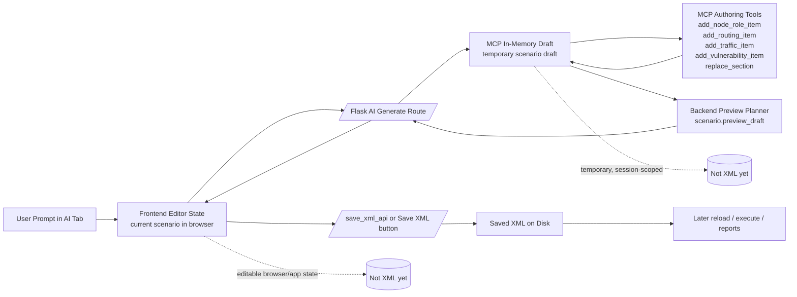

# Feature Deep Dive

## AI Generator workflow
- For a dedicated summary of the recent compiler, retry, validation, and preview-sync improvements, see [AI Generator Workflow](AI_GENERATOR_WORKFLOW.md).
- The AI Generator tab sends the current in-browser scenario state, the user prompt, the selected Ollama model/base URL, and the enabled MCP tools to the Flask AI generation route.
- Before model-authored rows are trusted, the backend runs a deterministic intent compiler in `scenarioforge/planning/ai_topology_intent.py`.
- That compiler currently owns explicit prompt intent for `Node Information`, `Routing`, `Services`, `Traffic`, `Vulnerabilities`, and `Segmentation`.
- The compiler emits two things from the same prompt: backend-compatible section payloads and MCP seed operations. Both the direct JSON path and the MCP bridge path use that same compiled intent so they do not drift.
- Practical rule: the model should supply missing details around the seeded template, but explicit counts and concrete section requests for compiler-managed sections are backend-authored, not free-form LLM-authored.
- In MCP mode, Ollama does not write XML directly. The backend opens the repo-local MCP server and creates an in-memory draft from the current scenario.
- Ollama then uses narrow `scenario.*` tools to mutate that draft. Typical tools are:
	- `scenario.get_authoring_schema`: fetch valid backend-supported section values and defaults.
	- `scenario.add_node_role_item`: add host rows under Node Information.
	- `scenario.add_routing_item`: add router rows and routing edge hints.
	- `scenario.add_service_item`: add Services rows.
	- `scenario.add_traffic_item`: add Traffic rows.
	- `scenario.search_vulnerability_catalog` and `scenario.add_vulnerability_item`: select and add vulnerability rows.
	- `scenario.replace_section`: replace an entire section with a backend-compatible payload.
	- `scenario.preview_draft`: run the backend preview planner on the current draft.
	- `scenario.save_xml`: persist the current draft to XML when explicitly needed.
- Those MCP tools execute repo/backend logic, not free-form model logic. The model chooses the tool calls, but the actual mutations and validation happen inside the backend.
- After direct JSON generation, the backend reapplies the compiled intent before preview so explicit compiler-managed sections cannot be silently overridden by malformed model rows.
- The preview shown after generation comes from the backend planner, not from the model. The planner computes routers, hosts, switches, flow metadata, and other derived state from the current in-memory draft.
- After a successful AI generation, the frontend replaces the current scenario/editor state with the generated scenario and stores the preview metadata in browser/app state. This still does not write XML by itself.
- XML is only written when a save path is used:
	- the normal Save XML button serializes the current editor state through `/save_xml_api`
	- the MCP tool `scenario.save_xml` can also persist the current in-memory draft

### Intent compiler boundary
- `compile_ai_topology_intent(...)` is the boundary between prompt understanding and scenario row authoring.
- Use the compiler for explicit structural asks such as router counts, host-role counts, service counts, traffic protocol/pattern counts, vulnerability counts with enabled-catalog grounding, and segmentation control counts.
- Use the model for what remains fuzzy: notes, non-compiler-managed details, or filling in optional context around a valid seeded scenario.
- `preview_full` remains the final validation authority. The compiler reduces authoring error rates; it does not replace backend preview, canonicalization, or concretization.
- The earlier `Phase1` naming has been removed; use the generalized intent-compiler names in new code and tests.

### Route registration pattern
- Extracted Flask route modules under `webapp/routes/` should register through explicit `register(app, ...)` functions and remain safe to call more than once.
- Shared idempotent registration lives in `webapp/routes/_registration.py`; use it instead of per-module ad hoc guard attributes.
- Internally, a route module may bind handlers directly or register a blueprint, but the external registration surface should stay explicit and idempotent.
- `webapp/app_backend.py` still performs the top-level registration and now logs route-registration failures instead of silently swallowing them.
- This pattern exists to tolerate import-order differences in tests and route-module extraction work without turning setup issues into silent `404` failures.

### State flow

### Persistence rules
- MCP draft: temporary, backend-side, session-scoped working copy.
- Frontend editor state: the currently loaded scenario in the browser after AI generation succeeds.
- Preview data: derived backend output used to validate what the current draft would build.
- Saved XML: only created when a save action happens.
- Practical summary:
	- AI Generate = edit the scenario in memory and preview it.
	- Save XML = persist the current scenario state to disk.

## Planning semantics
- Host planning honours **Base Hosts** (density) and **Count** rows; metadata is written into XML (`base_nodes`, `additive_nodes`, `combined_nodes`, etc.) for round-trip fidelity.
- Router and vulnerability planning capture derived vs explicit counts via `explicit_count`, `derived_count`, and `total_planned`.
- Scenario-level `scenario_total_nodes` summarises planned hosts, routers, and vulnerability targets.
- Parser helpers expose metadata programmatically: `scenarioforge.parsers.planning_metadata.parse_planning_metadata()`.
- Hardware-in-the-Loop plans persist per-scenario preferences (enabled state, interface list, attachment choice). Attachments normalize to `existing_router`, `existing_switch`, `new_router`, or `proxmox_vm`. When interfaces map to Proxmox VMs, the apply flow ensures the selected bridge exists on the node (creating it if needed) and rewrites the CORE/external VM adapters to land on that bridge.

## Router connectivity & aggregation
- Per-routing-item `r2r_mode` supports `Exact`, `Uniform`, `NonUniform`, and `Min`.
- R2S policies (`r2s_mode`, `r2s_edges`, optional `r2s_hosts_min/max`) regroup hosts behind dedicated switches, with “Exact=1” aggregating all hosts per router into a single switch.
- Preview JSON and runtime stats capture router degrees, aggregation counts, and Gini coefficients for quick balance checks.

## Traffic, segmentation, and services
- Traffic scripts land in `/tmp/traffic` (with companion services) and respect overrides for pattern, rate, jitter, and content hints.
- Segmentation scripts land in `/tmp/segmentation` alongside a `segmentation_summary.json`; NAT mode, DNAT probability, host inclusion, and docker port allowances are configurable.
- Docker vulnerabilities attach per-node docker-compose files in `/tmp/vulns`; generated services default to `network_mode: none` so CORE owns `eth0` and Docker does not add an unmanaged backend interface. Multi-service Compose networking is an explicit opt-in via `CORETG_COMPOSE_ALLOW_INTERNAL_NETWORKING=1` plus `CORETG_DOCKER_IFID_START=1`.
- Custom traffic plugins can register via `scenarioforge.plugins.traffic.register()` for bespoke sender/receiver code.

## Reports & artifacts
- Markdown reports (`./reports/scenario_report_<timestamp>.md`) enumerate topology stats, planning metadata, segmentation results, and runtime artefacts. Each run also emits a JSON summary alongside the Markdown file (`scenario_report_<timestamp>.json`) plus per-run connectivity CSVs when router degree data is available.
- Timestamp conventions:
	- Display/readable fields use local time `MM/DD/YY/HH/MM/SS`.
	- Filename/ID-safe values use local time `MM-DD-YY-HH-MM-SS`.
	- Report filenames append microseconds for collision safety: `scenario_report_MM-DD-YY-HH-MM-SS-ffffff.{md,json}`.
- Run history is persisted in `outputs/run_history.json` for the Reports page.
- Safe deletion keeps reports while purging associated outputs under `outputs/` when scenarios are removed via the GUI.

## Generator packs & manifests
- The Web UI treats **installed generators** as the source of truth: it discovers generators from `manifest.yaml`/`manifest.yml` under `outputs/installed_generators/`.
- Installed generators are managed as **Generator Packs** (ZIP files). You can upload/import packs from the Flag Catalog page.
- The repo does not ship a starter generator catalog; curated catalogs are imported or exported as ZIP bundles.
- Disable semantics:
	- Packs and individual generators can be disabled.
	- Disabled generators are hidden from Flow substitution and are rejected at preview/execute time.

## Flag sequencing (Flow) highlights
- Initial/Goal facts steer sequencing (flag facts are filtered out); synthesized inputs like `seed`, `node_name`, and `flag_prefix` are treated as known inputs.
- Sequencing uses goal-aware scoring with pruning/backtracking (bounded by a 30s timeout) to find feasible generator assignments.
- Attack Flow Builder export is the native `.afb` format (OpenChart DiagramViewExport).
- The Flow UI marks required inputs with `*` based on manifest inputs (`required: true`) and artifact `requires` (optional artifacts live in `optional_requires`).
- Goal Facts list shows per-variable source badges (e.g., `Seq I`) derived from the chain assignments.
- If a chain length exceeds unique eligible generators, the UI prompts to allow generator reuse; declining clears the chain.

## Vulnerability catalog packs
- The Web UI exposes a **Vuln-Catalog** page that mirrors the Flag Catalog pack UX.
- You can upload/import a ZIP containing directories/subdirectories.
	- Any directory that contains a `docker-compose.yml` is treated as a valid vulnerability template.
	- All other files in those directories are preserved.
	- The UI provides a per-pack file browser so users can download/view the extracted files.
	- The server generates a `vuln_list_w_url.csv` internally so downstream vulnerability selection/processing remains unchanged.

Vulnerability template testing:
- The Vuln-Catalog page includes a **Test** action per catalog item.
- When provided CORE VM SSH credentials, the test runs *on the CORE VM* and uses the same offline-safe docker preflight steps as scenario execution (build wrapper images, pull pull-only images, create containers with `--no-start`, then start with `--no-build`).
