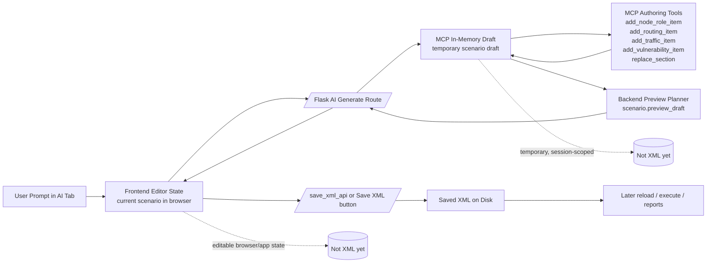

# Feature Deep Dive

## AI Generator workflow
- For a dedicated summary of the recent compiler, retry, validation, and preview-sync improvements, see [AI Generator Workflow](AI_GENERATOR_WORKFLOW.md).
- The AI Generator tab sends the current in-browser scenario state, the user prompt, the selected Ollama model/base URL, and the enabled MCP tools to the Flask AI generation route.
- Before model-authored rows are trusted, the backend runs a deterministic intent compiler in `scenarioforge/planning/ai_topology_intent.py`.
- That compiler currently owns explicit prompt intent for `Node Information`, `Routing`, `Services`, `Traffic`, `Vulnerabilities`, and `Segmentation`.
- The compiler emits two things from the same prompt: backend-compatible section payloads and MCP seed operations. Both the direct JSON path and the MCP bridge path use that same compiled intent so they do not drift.
- Practical rule: the model should supply missing details around the seeded template, but explicit counts and concrete section requests for compiler-managed sections are backend-authored, not free-form LLM-authored.
- In MCP mode, Ollama does not write XML directly. The backend opens the repo-local MCP server and creates an in-memory draft from the current scenario.
- Ollama then uses narrow `scenario.*` tools to mutate that draft. Typical tools are:
	- `scenario.get_authoring_schema`: fetch valid backend-supported section values and defaults.
	- `scenario.add_node_role_item`: add host rows under Node Information.
	- `scenario.add_routing_item`: add router rows and routing edge hints.
	- `scenario.add_service_item`: add Services rows.
	- `scenario.add_traffic_item`: add Traffic rows.
	- `scenario.search_vulnerability_catalog` and `scenario.add_vulnerability_item`: select and add vulnerability rows.
	- `scenario.replace_section`: replace an entire section with a backend-compatible payload.
	- `scenario.preview_draft`: run the backend preview planner on the current draft.
	- `scenario.save_xml`: persist the current draft to XML when explicitly needed.
- Those MCP tools execute repo/backend logic, not free-form model logic. The model chooses the tool calls, but the actual mutations and validation happen inside the backend.
- After direct JSON generation, the backend reapplies the compiled intent before preview so explicit compiler-managed sections cannot be silently overridden by malformed model rows.
- The preview shown after generation comes from the backend planner, not from the model. The planner computes routers, hosts, switches, flow metadata, and other derived state from the current in-memory draft.
- After a successful AI generation, the frontend replaces the current scenario/editor state with the generated scenario and stores the preview metadata in browser/app state. This still does not write XML by itself.
- XML is only written when a save path is used:
	- the normal Save XML button serializes the current editor state through `/save_xml_api`
	- the MCP tool `scenario.save_xml` can also persist the current in-memory draft

### Intent compiler boundary
- `compile_ai_topology_intent(...)` is the boundary between prompt understanding and scenario row authoring.
- Use the compiler for explicit structural asks such as router counts, host-role counts, service counts, traffic protocol/pattern counts, vulnerability counts with enabled-catalog grounding, and segmentation control counts.
- Use the model for what remains fuzzy: notes, non-compiler-managed details, or filling in optional context around a valid seeded scenario.
- `preview_full` remains the final validation authority. The compiler reduces authoring error rates; it does not replace backend preview, canonicalization, or concretization.
- The earlier `Phase1` naming has been removed; use the generalized intent-compiler names in new code and tests.

### Route registration pattern
- Extracted Flask route modules under `webapp/routes/` should register through explicit `register(app, ...)` functions and remain safe to call more than once.
- Shared idempotent registration lives in `webapp/routes/_registration.py`; use it instead of per-module ad hoc guard attributes.
- Internally, a route module may bind handlers directly or register a blueprint, but the external registration surface should stay explicit and idempotent.
- `webapp/app_backend.py` still performs the top-level registration and now logs route-registration failures instead of silently swallowing them.
- This pattern exists to tolerate import-order differences in tests and route-module extraction work without turning setup issues into silent `404` failures.

### State flow

```mermaid
flowchart LR
		U[User Prompt in AI Tab] --> FE[Frontend Editor State\ncurrent scenario in browser]
		FE --> API[/Flask AI Generate Route/]
		API --> MCP[MCP In-Memory Draft\ntemporary scenario draft]
		MCP --> TOOLS[MCP Authoring Tools\nadd_node_role_item\nadd_routing_item\nadd_traffic_item\nadd_vulnerability_item\nreplace_section]
		TOOLS --> MCP
		MCP --> PREVIEW[Backend Preview Planner\nscenario.preview_draft]
		PREVIEW --> API
		API --> FE
		FE --> SAVE[/save_xml_api or Save XML button/]
		SAVE --> XML[Saved XML on Disk]
		XML --> LOAD[Later reload / execute / reports]

		MCP -. temporary, session-scoped .-> X1[(Not XML yet)]
		FE -. editable browser/app state .-> X2[(Not XML yet)]
```

### Persistence rules
- MCP draft: temporary, backend-side, session-scoped working copy.
- Frontend editor state: the currently loaded scenario in the browser after AI generation succeeds.
- Preview data: derived backend output used to validate what the current draft would build.
- Saved XML: only created when a save action happens.
- Practical summary:
	- AI Generate = edit the scenario in memory and preview it.
	- Save XML = persist the current scenario state to disk.

## Planning semantics
- Host planning honours **Base Hosts** (density) and **Count** rows; metadata is written into XML (`base_nodes`, `additive_nodes`, `combined_nodes`, etc.) for round-trip fidelity.
- Router and vulnerability planning capture derived vs explicit counts via `explicit_count`, `derived_count`, and `total_planned`.
- Scenario-level `scenario_total_nodes` summarises planned hosts, routers, and vulnerability targets.
- Parser helpers expose metadata programmatically: `scenarioforge.parsers.planning_metadata.parse_planning_metadata()`.
- Hardware-in-the-Loop plans persist per-scenario preferences (enabled state, interface list, attachment choice). Attachments normalize to `existing_router`, `existing_switch`, `new_router`, or `proxmox_vm`. When interfaces map to Proxmox VMs, the apply flow verifies the selected bridge already exists on the node — operators pre-create it, and a missing bridge is a hard error rather than an auto-create — and rewrites the CORE/external VM adapters to land on that bridge.

### The plan is what runs

Everything a scenario is made of is decided **before** execute, and execute
realizes those decisions rather than making its own. This is not a nicety: the
plan is what the author reviews, what Flow builds its challenge chain against,
and what "accessible by pivot" places provider nodes for. A scenario that
quietly differs from its plan invalidates all three.

| What | How execute realizes it |
|---|---|
| Routers, hosts, switches, addresses, links | `_try_build_segmented_topology_from_preview` builds straight from `preview['hosts'] / ['routers'] / ['switches_detail']` |
| Services per node | applied from `services_preview` |
| Vulnerabilities per slot | forced onto the planned slots from `vulnerabilities_by_node` |
| Pivot provider nodes | materialised into the plan, then created like any other host |
| Segmentation rules | `plan_and_apply_segmentation(planned_rules=…)` applies the plan's rules; no new policy is drawn |
| Traffic flows | `generate_traffic_scripts(planned_flows=…)` writes the plan's flows; none are drawn |
| Traffic allow rules | the same code the preview predicted them with, over the same flows and the same policy |

Segmentation and traffic are the two that needed the most care, because both
planners draw from the **global `random` module** — at a dozen points in
segmentation's case. Re-running either is not "the same plan again" but a
different plan, and no amount of seed management fixes that, because the two
runs reach the planner with different amounts of unrelated randomness behind
them. A live run had the preview walling off three subnets and the same
scenario walling off two entirely different ones.

So each of those planners can now be handed its own earlier output:

- **Segmentation** — every planned rule carries a `script_spec`, everything its
  policy script depends on. Replaying is writing that script and enabling the
  recorded service, which reproduces the plan's policy *and* its scripts byte
  for byte. Only the script's file name carries over from the plan, since the
  run may be on a different host than the preview was.
- **Traffic** — flows fully determine every traffic artifact (`_write_agent_configs`
  draws nothing), so the plan's flow list is written out directly.

The preview's **predicted allow rules** are the run's actual allow rules, not an
estimate of them. `predict_allow_rules_for_flows` runs the same
`write_allow_rules_for_flows` the run uses, over the planned flows and the
planned policy, with no session (so it enables no services) and against a
scratch copy of the summary (so it writes nothing the run would read). It used
to sample random host pairs and invent a port per traffic kind, which meant the
preview displayed allow rules for flows the scenario does not have and omitted
the ones it does. Both halves became knowable once flows were planned and the
per-flow widen decisions were drawn from each flow's identity rather than from
`random`.

Both degrade loudly, never silently. A plan whose rules carry no `script_spec`
(saved before this existed) or whose flow list was truncated for payload size
is refused, execute logs why, and the planner runs as it used to — so the run
succeeds and the mismatch is stated rather than hidden.

#### Settings that shape the policy are plan-time inputs

A setting that only reaches execute arrives after the decisions it was meant to
influence have been made and reviewed. So everything that shapes segmentation
lives on the **Segmentation section**, travels with the scenario, and is read
when the plan is computed:

| Attribute | Default | What it does |
|---|---|---|
| `nat_mode` | `SNAT` | `SNAT` or `MASQUERADE` for NAT rules on routers |
| `include_hosts` | `false` | let hosts, not just routers, carry segmentation |
| `dnat_probability` | `0.0` | chance a generated flow gets a router port-forward |
| `allow_src_subnet_prob` | `0.3` | chance a traffic allow widens to the source subnet |
| `allow_dst_subnet_prob` | `0.3` | chance it widens to the destination subnet |
| `accessible_by_pivot` | `false` | the pivot-access toggle above |

The matching CLI flags (`--nat-mode`, `--seg-include-hosts`, `--dnat-prob`,
`--allow-src-subnet-prob`, `--allow-dst-subnet-prob`,
`--seg-accessible-by-pivot`) still work and now apply **when the plan is
computed**. Each defaults to `None` rather than to its value, so "not passed"
stays distinguishable from "passed the value that happens to be the default" —
without that, a flag could not sensibly override a scenario that sets the
attribute itself. The two switches only ever turn something *on*: omitting
`--seg-include-hosts` is not an instruction to override a scenario that enables
it.

Passing one of these at execute against a plan built without it cannot be
honoured, so execute logs exactly which settings it is ignoring and which values
the plan holds, rather than quietly giving you SNAT when you asked for
MASQUERADE.

`--seg-allow-docker-ports` is deliberately **not** a plan-time setting. It opens
ports belonging to containers, which do not exist until execute, so it stays a
run-time flag; the pass that implements it (`write_allow_rules_for_compose_ports`)
runs after the policy is in place and only adds ACCEPTs.

The two probabilities needed one more change to be meaningful as plan-time
inputs: the per-flow decisions they govern used to come from `random.random()`,
so the plan and the run answered differently for the same flow. `flow_draw`
derives the draw from the flow's own identity (endpoints, protocol, port)
instead, which keeps the probability semantics while making the answer a
property of the flow rather than of when it was asked.

### What a rule blocks: `effect`

`segmentation_summary.json` records the planner's **intent**, and its fields
change meaning with the chain a rule lands on:

| type | chain | emitted iptables | what it actually blocks |
|---|---|---|---|
| `subnet_block` | FORWARD | `-s src -d dst -j DROP` | transit, src to dst |
| `subnet_block` | INPUT | `-s src -j DROP` | **this node only** - `dst` is recorded but never matched |
| `host_block` | FORWARD | `-s a -d b -j DROP` | transit, a to b |
| `host_block` | INPUT | `-s a -d b -j DROP` | this node, a to b |
| `protect_internal` | FORWARD | `! -s net -d net -j DROP` | transit into net |
| `protect_internal` | INPUT | `! -s net -j DROP` | **this node only**, from outside net - and the node need not be in net |

The two bold rows only occur with `include_hosts`, which is why they went
unnoticed. Every consumer re-derived "what does this block" from those fields
and they disagreed - pivot access read every rule as subnet-scoped and built a
provider node in a subnet nothing was protecting.

So each rule now carries a normalized **`effect`**, computed in
`utils/segmentation_effects.py` where the chain, the node and the rule are all
still in hand:

```python
{'scope': 'transit' | 'node',   # FORWARD vs INPUT
 'enforced_by': node_id,
 'blocks': bool,                # False for NAT and CUSTOM, which deny no path
 'protects': '<cidr or ip>',    # what is actually shielded
 'blocks_from': '<cidr or ip>', # what is actually shut out
 'invert_source': bool,         # blocks everything EXCEPT blocks_from
 'default_deny_chain': '<chain>'}
```

What keeps it honest is `effect_from_iptables`, which reads the effect back out
of the emitted command. The two are computed from different things on purpose -
one from the planner's variables, one from the text actually written - and a
property test compares them across every rule the planner can produce, over a
sweep of seeds and both placement modes. An effect that does not describe the
rule that was written is exactly the fault the model exists to prevent, so it is
the one thing worth testing that way.

`walled_off_details` now reads effects: only a **transit** block walls a subnet
off, and a block protecting a single address is skipped for the reason
`host_block` always was - the only node in a `/32` is the blocked host, so the
"pivot" would be an allow straight back into what the rule exists to block.
Plans saved before effects existed still work, falling back to the emitted
command and then to the old fields.

Every consumer reads effects now, through `effect_of` (which prefers the
recorded effect, then the emitted command, then the old fields) and
`effect_blocks` (which answers "does this deny src to dst"). One matcher serves
both scopes because `protects` already carries the difference: a transit rule
protects a network, a node-scoped one protects the single address of the node
running it, so "is the destination behind this rule" is the same question either
way. What each consumer stopped getting wrong:

- **`_flow_allowed_by_summary`** required the destination to sit inside the
  subnet a `protect_internal` names, which is false for a host-enforced one. A
  flow it drops was judged fine, no allow was written, and the traffic silently
  never flowed - while the FORWARD allow *was* written, so the packet crossed
  the routers and died on arrival.
- **`verify_flows_allowed`** calls that same checker, so it inherits the fix.
  Its synthetic hosts remain: it sees flows and rules but never the topology, so
  it reconstructs hosts from flow addresses purely to work out whether a flow
  crosses a router. The prefix is `DEFAULT_IPV4_PREFIXLEN`, which
  `preview_validation` enforces on every subnet - an assumption the plan
  guarantees rather than a guess.
- **`webapp/artifact_checks.py`** filtered on `"block" in type`, so no
  `protect_internal` drop was ever explained and every one was reported as
  "packets dropped and no segmentation rule covers this path" - a fault, for a
  scenario doing exactly what it was told.

#### What "port unreachable" means under default-deny

The ports check probes each node's listening TCP ports from a node that should
reach them. Two things decide whether a drop is a fault:

**Which node probes which port.** The prober is chosen per **(node, port)**: the
source of the flow that uses *that port* when one exists, otherwise a peer on
the target's own subnet, otherwise any node. Choosing it per *node* instead
meant a node receiving three flows had all three ports probed from the source of
the first, and its service ports probed from a sender that was never meant to
reach them. Falling back to a same-subnet peer also asks the more useful
question of a service port - does this service answer at all - without crossing
a segmentation boundary to do it.

**Whether anything was supposed to open the path.** A drop is classified in this
order: a specific rule whose effect covers it (configured); an allow rule that
opens it, meaning the scenario arranged for this path and it failed anyway (a
fault, and the one shape here worth investigating); the default-deny policy,
under which a port no rule opens is *meant* to be unreachable (configured); and
otherwise, unexplained (a fault). Without the third case a segmented scenario
reports most of its ports as faults - routing-daemon vty ports, database ports,
every flow port probed from the wrong sender - and the real signal is lost in
them.

## Router connectivity & aggregation
- Per-routing-item `r2r_mode` supports `Exact`, `Uniform`, `NonUniform`, and `Min`.
- R2S policies (`r2s_mode`, `r2s_edges`, optional `r2s_hosts_min/max`) regroup hosts behind dedicated switches, with “Exact=1” aggregating all hosts per router into a single switch.
- Preview JSON and runtime stats capture router degrees, aggregation counts, and Gini coefficients for quick balance checks.

## Traffic, segmentation, and services
- Traffic artifacts land in `/tmp/traffic` — one `traffic_<node_id>.json` agent config per node, the static agent binaries for both architectures, and `traffic_summary.json` — and respect overrides for pattern, rate, jitter, and content hints. They are per-flow *scripts* no longer: a vulnerability image often has no `python3`, so traffic assigned to a Docker node silently never ran.
- Segmentation scripts land in `/tmp/segmentation` alongside a `segmentation_summary.json`; NAT mode, DNAT probability, host inclusion, and docker port allowances are configurable.
- Both traffic and segmentation are decided at plan time and replayed at execute; see [The plan is what runs](#the-plan-is-what-runs).
- **The routing control-plane recheck's retry budget scales with how slow the VM actually is, not a fixed 2.5s.** After CORE reaches runtime, `_ensure_router_control_planes` reapplies and verifies each router's Quagga/FRR config -- CORE's boot script can race the daemon's control socket on a busy VM. The retry budget used to be a fixed 5 attempts x 0.5s, sized for that brief race; a real run needed a 45s Docker restart-recovery elsewhere in the same execute and then had this check give up on every router 2.5s later, reporting "Routing control-plane configuration did not load" for a VM that just needed longer, not one that was broken. Defaults are now ~60s (40 x 1.5s), overridable via `CORETG_ROUTING_CONTROL_PLANE_ATTEMPTS` / `CORETG_ROUTING_CONTROL_PLANE_RETRY_DELAY_S` for a site whose CORE VM runs reliably slower or faster.
- **The routing failure message now says which of two different problems it is.** Extending the retry budget surfaced a case that no amount of retrying fixes: a run whose CORE session never left "configuration" for its whole start timeout, where every `vcmd` call against its routers failed outright because their netns never came up at all -- a router that stays unreachable for the entire retry window is a different failure than one `vcmd` *can* reach whose Quagga stanza simply hasn't loaded yet, and needs a different fix (investigate CORE VM load / raise `--start-timeout-s`, not wait longer on this check). The error now names each router under whichever cause actually applied to it, rather than one generic "did not load" that reads like a Quagga problem when the session itself never finished building the topology.
- **Catalog items record which CPU architectures they can run on, and that travels with the export.** An amd64-only image on an arm64 CORE VM runs only under qemu emulation, where heavy applications do not survive: a real run had two Confluence nodes exit 139 (SIGSEGV) mid-boot, restart, and lose the addressing CORE applies at execute — a failure that presented as a networking fault, not an architecture one. Vulnerability and flag-generator catalog items now carry `architectures`, `architecture_source` and `architecture_unresolved`, resolved cheapest-first from an explicit compose `platform:`, then a locally cached image (`docker image inspect`, no network), then the registry (`docker manifest inspect`). The UI badges anything that would be emulated on this host. Two distinctions are load-bearing: an **empty** architecture list means *not known* and never disables anything — otherwise an unscanned catalog would disable itself wholesale — while a stack whose images share **no common** architecture is a real finding (`Mixed Arch`), because one amd64-only sidecar makes the whole node emulated wherever it runs. Scanning is controlled by `CORETG_CATALOG_ARCH_SCAN` and `CORETG_CATALOG_ARCH_SCAN_REGISTRY`.
- **A catalog export carries everything an import cannot work out for itself.** Alongside the existing notes and category layout, exports now write `.scenarioforge/catalog_items.json` with each item's architectures and the operator's own curation (`disabled`, `disabled_by_operator`, `persistent`). Architecture is the case that matters most: an air-gapped CORE host has no registry to ask, so without carrying the scanned values it could never tell an amd64-only item from an unscanned one. An imported *enable* is deliberately not authoritative — a catalog curated elsewhere cannot vouch for missing files or a build network on **this** host, so a local auto-disable still wins; only an imported *disable* is additive. Catalogs exported before this metadata existed import unchanged.
- **A vulnerability's own sidecars reach it over loopback, without a Docker network.** Every generated service runs `network_mode: none` so an exploited node cannot reach the host or another node through a Docker-managed gateway. That silently broke any recipe whose app addresses its *own* sidecar by service name — nginx → php-fpm, app → db — which is roughly a quarter of the vulhub catalog, because a plain multi-service compose file needs no `depends_on`/`links`/`networks` for service-name DNS to work under vanilla `docker-compose up`. The app then crash-looped permanently, and in a real run CORE's daemon threw an unhandled exception wiring a veth into the dead container's stale PID, aborting the rest of session boot including three unrelated routers: one incompatible vulnerability took the whole scenario down. Sidecars now join the node's **own network namespace** (`network_mode: service:<node>`) and talk over loopback, with `extra_hosts` mapping each sidecar's service name to `127.0.0.1` so the recipe's config (`fastcgi_pass php:9000`) resolves unchanged. The namespace still holds only `lo` — no Docker interface, no gateway, no route to the host or the internet — so CORE keeps `eth0` and no interface renumbering is needed. Measured directly against Docker: a `internal: true` network was rejected for this because it still reaches services on the Docker host via the bridge gateway address, which is the exact exposure `network_mode: none` exists to prevent. The only stacks still excluded are those that cannot share one namespace at all — two services binding the same container port, since one namespace is one port space (2 of 295 in the catalog this was built against, both of which run two independent web apps on port 80).
- **`cleanup-scenarioforge-docker` (the remote "dangerous cleanup" command) now keeps prerequisite and persistent images by default.** It used to remove every container and image on the remote host unconditionally -- which meant every run using it re-provisioned busybox, the wrapper base, inject-copy, the pivot provider image, and anything an operator pinned `persistent`, exactly the re-provisioning cost pre-seeding those images for an air-gapped host exists to avoid. It still removes every container (containers carry no persistence concept) and every other image, unchanged; pass `--include-prerequisites` for the old literal remove-everything behavior. This is transparent to `scenarioforge-eval`'s `--dangerous-cleanup-between-runs`, which invokes this command with no extra flags and picks up the safer default automatically.
- **A Docker node's crash-recovery attempt must not collide with its own corpse.** CORE names a Docker node's container after the node itself (`docker-N`), and the generated compose file pins that same fixed `container_name:` rather than a project-scoped one. When a container is found not-running (a heavy amd64 image under qemu emulation on an arm64 CORE VM is the common trigger — Confluence and similarly slow apps can restart once or twice during boot), the recovery path calls `docker compose up -d <service>` with no `-p` of its own, so Compose resolves its project from the compose file's directory rather than whatever project originally created the container — and then tries to *create* a container under the fixed name Docker still holds for the dead one, refusing with a naming conflict. This took down a whole execute (before post-execution validation ever ran) in a real eval run. The recovery path now removes the dead container by name before recreating it.
- **A host that finishes the build with no IPv4 address fails the phase loudly.** Such a node runs but has no route to anything, so every flow, challenge and pivot touching it silently cannot work — this shipped once as a scenario whose fifteen nodes were all unlinked, and nothing said so until the traffic reachability check failed much later, pointing at traffic rather than at the topology. Every builder path now reports the offending node ids at `ERROR`, and records them as `hosts_unaddressed` in the run metadata and the scenario report.
- **The plan decides the endpoints; this run decides their addresses.** A replayed flow keeps its node ids, protocol, port, rate and pattern, but each endpoint's IP is rebound to the address that node actually has in the topology built by this execute. A plan carrying addresses from a different draw otherwise made senders dial IPs no node owned — the flows never connected, and the artifact check (which matches flows to running nodes by address) reported `traffic source node not found for <ip>` for every one of them. Endpoints absent from this run keep the planned address rather than being given an invented one.
- **Both ends of a flow retry for the whole run.** A sender re-dials indefinitely, backing off 1s→15s, so a flow starts as soon as routing converges — OSPF adjacency on a large topology can take minutes. A receiver now retries its bind on the same terms: returning on the first `listen` error killed the flow permanently, and the sender then retried forever against a node that would never listen again, which reads as an unreachable destination rather than a dead receiver. Both log the first failure and every thirtieth, plus the recovery, so a slow convergence is visible without filling the node's log.
- The launcher (`TrafficService`) waits up to ~60s for its `/tmp/traffic/traffic_<node_id>.json` to appear rather than checking once, and supervises the agent so a process that dies is restarted after 5s. A signalled exit (128+N) is treated as session teardown and is *not* restarted, so the loop never fights CORE's own cleanup.
- Docker vulnerabilities attach per-node docker-compose files in `/tmp/vulns`; generated services default to `network_mode: none` so CORE owns `eth0` and Docker does not add an unmanaged backend interface. Multi-service Compose networking is an explicit opt-in via `CORETG_COMPOSE_ALLOW_INTERNAL_NETWORKING=1` plus `CORETG_DOCKER_IFID_START=1`.
- Custom traffic plugins can register via `scenarioforge.plugins.traffic.register()` for bespoke sender/receiver code.

### Accessible by pivot

Segmentation under a default-deny policy can wall a subnet off so completely
that nothing inside it is reachable, which makes any challenge placed there
unsolvable. A real scenario hit exactly this: `172.21.240.0/24` was blocked from
two subnets and none of its seven nodes exposed SSH, so the only path through
the boundary was one chain flow scoped to a single source IP.

The **Accessible by pivot** toggle (Segmentation section, or `--seg-accessible-by-pivot`,
or `accessible_by_pivot="true"` on the section element) guarantees every
walled-off subnet keeps one reachable **provider**: a node inside it exposing a
vulnerability, a flag-node-generator, or SSH through the boundary.

Provider selection is hybrid and prefers what already exists:

1. a node already offering a **vulnerability** — the pivot becomes a real challenge step;
2. a node already offering a **flag-node-generator**;
3. a node already running **SSH**;
4. otherwise a **Docker SSH node is added**, built from `PIVOT_SSH_IMAGE`
   (override with `CORETG_PIVOT_SSH_IMAGE`) and reachable on `PIVOT_SSH_PORT`
   (override with `CORETG_PIVOT_SSH_PORT`).

The added provider's port is **2222, not 22**, because the default image is a
rootless sshd. The port follows the image: it is what the allow rule opens and
what the participant connects to, so a site pointing `CORETG_PIVOT_SSH_IMAGE` at
its own mirror sets `CORETG_PIVOT_SSH_PORT` alongside it.

There is deliberately no "turn SSH on for whatever Docker node is already
there" tier. Node images are built offline-safe with **no package manager** —
the wrapper only injects a busybox `ip` — so a minimal image cannot grow an
`sshd`, and enabling the CORE SSH service on it produces an open path to a
closed port. A node that genuinely serves SSH is already tier 3.

**Only Docker-backed nodes are ever eligible.** CORE vnodes — routers, PCs,
servers, workstations — get a network namespace but not a mount namespace, so
they share the CORE VM's filesystem. Handing a participant SSH on one is a host
escape, not a pivot. That excludes the routers too, so a subnet whose hosts are
all unfilled challenge slots has to grow a node rather than borrow the router
already sitting in it.

Step 4 deliberately skips unfilled challenge slots. Consuming one would
silently spend capacity the author allocated for challenges, so **a provider
never counts against configured vulnerability or flag-node-generator slot
counts** — anything placed for pivot access is additive.

**Provider selection happens at plan time**, not at execute time. The topology
is built well before the segmentation phase runs, so a provider that has to be
*added* must be known while nodes are still being planned. `build_full_preview`
therefore computes the plan and publishes it as
`segmentation_preview.pivot_access`, making the requirement — including how many
nodes must be created and from which image — visible before anything is built.

An `added` provider is then **materialised into the same plan**: the node is
allocated an id above every existing node, given a free address inside the
walled-off subnet, linked to that subnet's switch and router, and marked with
the image it must boot. From there it is an ordinary Docker host in the preview
payload and the builder creates it like any other — except that its compose
entry is pinned to the provider image rather than the standard node template,
which serves nothing to pivot through. Its address is what the allow rules then
open, so `pivot_access` reports a `node_id`, a `node_name` and an `address` for
every provider.

The node is allocated **above every existing id** deliberately. Challenge slots
are numbered positionally over the sorted host list, so an id in the middle
would shift every later host's slot and hand a challenge to the wrong node. For
the same reason the provider is excluded from the role counts that produce the
slot range, and from the plan-parity totals execute compares against the XML —
the XML never asked for this node, so counting it would make every
pivot-enabled scenario fail preflight as "does not match".

A later plan over a topology that already carries a provider **reuses that
node** rather than adding a second one: the materialiser leaves a marker on the
node, and `provisioned_entry_points` turns it back into an SSH entry point. Such
a provider keeps reporting as `added: true` — the node exists only because of
this feature, and calling it *reused* would credit the scenario with a node it
never asked for.

That recognition reads the **plan**, never the live CORE session.
`core.api.grpc.wrappers.Session` has no `get_node` on the CORE builds this runs
against, so a lookup keyed on session node names comes back empty and the
provider goes unrecognised — which is exactly how a live run ended up adding a
second provider per subnet. Node names and provider identity therefore come
from the preview payload.

When a provider cannot be placed at all — no switch serves the subnet, or the
subnet has no free address — it is left in `unresolved` with the reason, and
execute logs a WARNING naming the affected subnets rather than letting a
participant discover an unsolvable challenge.

Providers are placed for the subnets the **plan** walls off, so this feature
depends on execute enforcing that same policy rather than drawing a new one —
see [The plan is what runs](#the-plan-is-what-runs). Without it, providers sit
in the subnets the preview blocked while the running scenario blocks others.

**Docker nodes never need the internet at execute time.** CORE starts a Docker
node the moment it is added, so execute resolves every provider image **before
the topology is built**, in this order:

This covers every **framework prerequisite**, not just the provider images. An
operator picks the vulnerabilities and generators their lab contains and seeds
those; they should not also have to discover by watching a run fail that the
framework needs a busybox to build each node's wrapper, an ubuntu for the
standard node, an alpine to copy inject files in, and a python for the shipped
generator templates. `utils/prerequisite_images.py` names them, from code
constants *and* from the repo's own compose templates so a template added later
registers its base automatically, honouring the same environment overrides a
site uses to mirror its own registry. All of them are in the persistent keep set
and prepared before the topology build.

That gap was real: a live run lost the wrapper base and could then build nothing
on a host whose Docker daemon had no DNS, while the provider image, being
pinned, survived.

When an image cannot be found the run reports every missing one together, with
the exact commands to stage them — an air-gapped host is missing them all at
once, so a warning per image is the wrong shape:

```
Air-gapped hosts need these 2 image(s) staged before a run. On a machine with network access:
  docker pull busybox:1.36.1-musl && docker save busybox:1.36.1-musl -o /opt/coretg/images/busybox_1.36.1-musl.tar
  docker pull ubuntu:22.04 && docker save ubuntu:22.04 -o /opt/coretg/images/ubuntu_22.04.tar
Copy the resulting tarballs to /opt/coretg/images on this host; they are loaded from there instead of pulled.
```

1. **already present** — `docker image inspect` succeeds and nothing is pulled;
2. **pre-seeded tarball** — `<CORETG_PIVOT_IMAGE_CACHE_DIR>/<safe-name>.tar`
   (default `/opt/coretg/images`) is `docker load`ed, so an air-gapped host
   never touches the network. Seed it with
   `docker save <image> -o /opt/coretg/images/<safe-name>.tar`;
3. **pulled once** — only if neither of the above applies.

Once present the image is **cached forever**: it is added to the persistent
keep set, so the execute-time image cleanup cannot reclaim it and force another
download. A pull that fails is logged with the `docker save` command to seed it,
and does not fail the run.

**A provider's entry port is opened to `0.0.0.0/0`**, not to the subnets the
block took access away from. A provider is the subnet's entrance, and who has to
walk through it is not knowable from the rule that closed the subnet: the
participant sits on a HITL link subnet that appears in no segmentation rule at
all, and what actually stops them is the blanket `-P FORWARD DROP` rather than
any specific block. Scoping the allow to `blocked_from` locked the participant
out of the one node built to let them in - and did so unevenly, since a
`protect_internal` yields `*` and opened it to everyone by accident while a
`subnet_block` did not. Exactly one port on one node becomes reachable; the rest
of the subnet stays walled off, which is the whole design.

#### Nested pivots (not supported yet)

A *nested* pivot is a provider you can only reach by first working through
another provider. **`NESTED_PIVOTS_SUPPORTED` is `False`** and every provider is
opened to `0.0.0.0/0`, so all of them are directly reachable and the ordering
between them is flattened.

Turning it on is more than flipping the flag. FORWARD allows go to **every**
router by necessity - the planner cannot know the route, and a live run showed
the enforcing router passing a SYN while an upstream router dropped it - so
there is no hop at which a later provider could be held back. Real support needs
route-aware, per-hop allow placement, which the planner deliberately does not
attempt.

Until then, ordering between pivots is carried by the **challenge**: you need
what the earlier step gave you. That is how `pivot_chain` already reasons -
on capability, not on topology - so nothing is lost for a chain whose steps
genuinely depend on each other.

`nested_pivot_candidates` reports where an author's segmentation implies an
ordering: a subnet walled off *only* from other walled-off subnets reads as
"get into the outer one first". Those appear in the `pivot_access` report as
`nested_candidates`, alongside `nested_supported: false`, and are logged at
execute. The limitation is stated rather than discovered.

`blocked_from` stays on the provider as the *audience*: the subnets the block
shut out, plus the HITL link networks a participant sits on. Those are recorded
as networks, never single addresses - a participant who re-addresses inside
their own subnet is the same participant, and a selector pinned to one address
would be defeated by a new DHCP lease. A single address handed in is dropped
with a warning rather than widened, since widening would mean guessing a prefix.

The resulting allow rules are appended to `segmentation_summary.json` tagged
`reason: pivot-access`, so they are distinguishable from the allow rules written
for traffic flows, and a `pivot_access` block records which provider was chosen
for each subnet and how. FORWARD allows are installed on **every** router, not
only the one enforcing the block: segmentation leaves every router with
`-P FORWARD DROP`, so a packet has to survive each hop and the planner cannot
know the route. INPUT lands on the provider, where a default-deny policy would
otherwise drop the packet on arrival.

The toggle is **off by default**, so an existing scenario keeps the exact
segmentation it was authored with.

#### Check 8: can the participant reach the provider?

The artifact validator's eighth check answers the question the whole feature
rests on. A provider is the only way into its subnet, so a participant who
cannot reach it cannot solve anything behind that boundary - which makes an
unreachable provider a **failed** check, not a warning.

It reads the rules rather than sending packets, because the participant's
vantage point cannot be probed from: the HITL node is an RJ45 bound to a
physical interface, not a namespace the checker can enter. Reading the rules
also means it still runs with nothing plugged in, which is when an author is
most likely to be looking at it.

The participant network comes from the HITL link subnets, which are computed
deterministically from the scenario and interface name, so the check knows them
without asking the hardware. It probes from an address *on* that network rather
than any particular one - the question is whether the network can get in, and
pinning it to one address would make the check turn on a DHCP lease. With no
HITL configured the question is still meaningful, so it is asked from an address
outside the walled-off subnet instead.

It fails when a provider has no node placed for it at all, and when no allow
rule opens the provider's own entry port from the participant.

#### Hinting a pivot that is its own step

An `own_step` pivot is real work with no generator behind it, so it needs a hint
of its own. The tier follows how discoverable the provider is:

| provider offers | tier | why |
|---|---|---|
| a vulnerability or a flag-node-generator | **medium** | the participant is scanning that node anyway and will find the challenge; a nudge is enough |
| SSH only (an added provider) | **high** | nothing to solve on it, and nothing about it says "this is the door" - without being told, there is no reason to try it |

An **absorbed** pivot gets no hint of its own. It is a consequence of a
challenge the participant is already being hinted through, so hinting it
separately would give that step away for free.

The tier is computed on the decision (`hint_level`, `hint_levels`) and rendered
from there by both guides. Neither template recomputes it - the chain row in
`flow.html` and the guide in `reports.html` read the same server-side answer, or
they would drift.

#### Where the pivot shows up in the chain

Whether a pivot is its own challenge is decided by capability, not by node. If
the challenge already on the provider grants code execution there, solving it
leaves the participant on the node, so pivoting onward is a consequence of work
already done and folds into that step (**absorbed**). A bare SSH box, a router,
or a challenge that only leaks a file or a credential earns a step of its own
(**own_step**).

`CodeExecution(host)` is the test, because the fact subsumption in
`vulns.metadata` already routes every RCE-shaped impact through it, so
`remote_code_execution`, `command_injection`, `deserialization`, `web_rce` and
`privilege_escalation` qualify while `auth_bypass`, `arbitrary_file_read`,
`sql_injection` and `credential_disclosure` do not. One wrinkle compensated for
in `pivot_chain`: `_SUBSUMES` maps the one-argument `Shell(host)` but not
`Shell(host, user)`, which is equally a shell on the host.

Because Flow runs *before* execute, this is decided from the **preview**
topology and preview segmentation rules, not the runtime
`segmentation_summary.json`. The toggle therefore travels with the plan:
orchestrator → `segmentation_preview.accessible_by_pivot` → Flow.

- **Absorbed** pivots stamp `pivot_grants` on the assignment. Flow chain rows
  draw a bold star badge next to the node and the guides add a star plus a row
  naming what solving the step opens.
- **own_step** pivots are rendered as their own row in Flow and their own
  section in the guides, positioned immediately before the first chain step
  inside the subnet they unlock (`insert_before`).

An own_step pivot is deliberately **not** injected into `currentChain`. Chain
nodes and flag assignments are aligned by index throughout the Flow UI and the
exports, and a synthetic step has no generator to resolve, so injecting one
would desynchronise sequencing and break execute. It is a presentation step:
real work for the participant, not a generator to run.

## Reports & artifacts
- Markdown reports (`./reports/scenario_report_<timestamp>.md`) enumerate topology stats, planning metadata, segmentation results, and runtime artefacts. Each run also emits a JSON summary alongside the Markdown file (`scenario_report_<timestamp>.json`) plus per-run connectivity CSVs when router degree data is available.
- Timestamp conventions:
	- Display/readable fields use local time `MM/DD/YY/HH/MM/SS`.
	- Filename/ID-safe values use local time `MM-DD-YY-HH-MM-SS`.
	- Report filenames append microseconds for collision safety: `scenario_report_MM-DD-YY-HH-MM-SS-ffffff.{md,json}`.
- Run history is persisted in `outputs/run_history.json` for the Reports page.
- Safe deletion keeps reports while purging associated outputs under `outputs/` when scenarios are removed via the GUI.
- The Reports page **Downloads** menu also produces a **Solutions Script** (`.sh`) — see below.

## Solutions Script
A downloadable, self-checking bash script generated from the resolved Attack Flow chain. Use it to confirm a deployed scenario is actually solvable, rather than only structurally correct.

- Download it from the Reports page **Downloads** dropdown ("Solutions Script (sh)"), alongside the participant and facilitator guides.
- For each step it establishes the documented entry point, retrieves the step's flag, and reports **PASS / FAIL / INCONCLUSIVE / SKIP** with reasoning, plus a summary line and a nonzero exit when anything fails.
- Reachability: it runs directly when the host routes to the CORE node subnet, or tunnels every command through the CORE VM with `--ssh-host/--ssh-user/--ssh-key/--ssh-port`. Use `-v` to see raw command output.
- **`--via-node NODE` runs every check inside that node's network namespace**, which is what a CORE VM deployment needs. A stock CORE VM has no route into the emulation — `ip route get <node ip>` on the VM leaves via its default gateway — so payloads run on the VM itself reach nothing in the scenario, and every check reports its target unreachable. Docker nodes are entered with `docker exec` and CORE vnodes with `vcmd`; which a node is is not knowable from the script, so it tries one then the other. Add `--session-id N` when the session is not 1, and `--sudo-pass P` (or `--no-sudo`) because entering a namespace needs root. Combine with `--ssh-host` to drive the whole thing from your own machine. The banner states where the checks actually ran.
- Scope: **flag-node-generators only**. Vulnerability and flag-generator steps are emitted as `SKIP` with their reason, because they do not yet ship machine-runnable `access_instructions`.
- Entry points it automates: SSH (password and key based), HTTP/HTTPS (including header- or query-gated steps that must present a prior step's `Checksum`/`Ticket` fact, and basic-auth WebDAV), raw TCP protocol dialogs, and NFS mounts.
- **Pivot steps are verified.** A pivot that is its own chain step is emitted as a `check_pivot` before the step it gates, asserting the provider answers on its entry port. If it does not, every challenge behind that boundary is unreachable however well it was built, so that is a **FAIL**. The script does not then tunnel through the provider: solving its challenge is the participant's work, and the steps behind it are checked from the CORE VM, which reaches the node subnets directly. An **absorbed** pivot gets no check — it is a consequence of a challenge already being checked. A provider with no address yields no check either, because the plan already reports it as `unresolved` and execute warns about it.
- The generated script does not replay the human `access_instructions` verbatim — those are written for people and include interactive prompts and host-side paths. Instead it detects each step's entry tool, derives a deterministic retrieval from the resolved artifacts, and asserts the known `Flag(flag_id)` value. The documented steps are preserved as comments for context.

## Artifact checks (live session validation)
Verifies that a **running** CORE session matches what the scenario said it should be. Available as a per-session icon button in the CORE page **Active sessions** card, and as the `check-artifacts` CLI phase.

Nine ordered checks, each reported as `pass`, `warn`, `fail`, `error`, or `skip`:

1. Containers running on the correct nodes.
2. Services running.
3. Service ports open and reachable across the CORE network.
4. Inject files placed in the right location.
5. Firewall/segmentation rules in place.
6. Traffic agents running where they should be.
7. Each traffic source reaching its destination, tested on the flow's own protocol and port.
8. Each Flow challenge-chain pivot path traversable from its source node to its target.
9. Each segmentation pivot provider reachable from the participant.

### The two "pivot" checks are unrelated features

Checks 8 and 9 both say "pivot" and are routinely confused. They answer different
questions, for different actors, and neither one's result says anything about the
other.

|                | 8 — Flow pivot paths | 9 — Pivot providers |
| -------------- | -------------------- | ------------------- |
| Question       | once you are inside, can you move along the chain? | can you get inside at all? |
| Probes from    | the source node's own namespace | the participant network |
| Probes to      | the next challenge's service port | the provider node's entry port |
| Direction      | inside → inside | outside → inside |
| Created by     | Flow sequencing, as `Pivot(node)` facts | Segmentation's `accessible_by_pivot` |
| Access is      | **earned** by exploiting the source node | **granted** by a provisioned allow rule |

**Check 8** validates the network precondition of a challenge dependency. When Flow
records `Pivot(docker-7)` on a challenge, the participant is expected to solve
docker-7 first and attack the next target from there — typically because that target
carries `exposure: pivot-only`, so segmentation admits it only from the pivot
source's address. The check enters the source node's network namespace and opens a
TCP connection to the target's port, because reachability is vantage-dependent:
under default-deny a target may be reachable from a router and not from the node the
participant will actually be standing on.

It does **not** exploit anything. It never verifies that the vulnerability works, or
that solving the source yields what the target requires — that side is settled at
plan time by the capability solver matching each vuln's declared `requires`/`provides`
facts (see `VULN_CAPABILITY_METADATA.md`). "The challenge chain is unsolvable" in this
check's summary means *the path does not exist*, not *the puzzle is wrong*.

**Check 9** exists only when segmentation seals a subnet off from the participant
entirely. Everything behind that wall is then unsolvable from the start, so
`accessible_by_pivot` places a reachable **provider** node inside it — added new or
reused from the subnet's existing hosts — and opens one allow rule from the
participant network to its entry port. The check verifies that single rule really
admits the participant. Three outcomes: an empty provider list is a `skip` (nothing
was walled off); a provider with no address or port is a `fail` (an entrance was
required and never placed); a placed provider is checked against the allow rules and,
where a vantage exists, confirmed on the wire.

A scenario can legitimately have one and not the other. If a vulnerability in the
chain grants the access, that is check 8; if the scenario has to *hand over* access
because no challenge can provide it, that is check 9. A chain full of `Pivot()` steps
with `accessible_by_pivot` switched on will still skip check 9 whenever segmentation
never produced a subnet needing an entrance — the toggle was on and had nothing to do.

Three unrelated things wear the word "pivot", which is the root of most of the
confusion:

- `Pivot(node)` — a Flow fact: a challenge dependency.
- `provider: vulnerability` on a Flow pivot rule — *how* the participant gets onto the
  pivot source (by exploiting it), as opposed to `ssh-fallback` where a shell is
  installed for them.
- a **pivot provider node** — Segmentation's entrance through a wall, and the only one
  of the three that check 9 measures.

Implementation notes:

- Checks 1-4 reuse the post-execution validator that backs `--post-execution-validation`.
- Checks 5-7 are live probes run on the CORE VM over SSH. Docker-backed nodes are reached with `docker exec`; namespaced CORE vnodes (routers, PCs) with `vcmd -c /tmp/pycore.<session>/<node>`.
- Port reachability is measured **across the CORE network**, because VM-mode nodes publish no host ports. Listening ports are discovered from `/proc/net/tcp[6]`, and loopback-only binds (for example Tomcat's AJP on `127.0.0.1`, including the IPv4-mapped `::ffff:127.0.0.1` form) are reported as context rather than probed.
- **Every port is probed from a node that should reach it**, not from one global prober. Each target picks its own vantage point: the source of a traffic flow to that target, else a peer on the target's own subnet, else any node. Probing everything from a single node measures that node's position in the topology — a prober on the far side of a segmentation boundary reports healthy services as unreachable.
- **Drops that a segmentation rule explains are reported as configured behaviour, not warnings.** Each dropped path is matched against the `subnet_block`/`host_block` rules in `segmentation_summary.json` using the prober's and target's addresses; only drops with no matching rule warn. The segmentation probe therefore runs before the ports check reports, even though it is presented as check 5.
- A connection **timeout** means packets are dropped and is reported as a blocked path; a **refused** connection means the port closed between enumeration and probe and is treated as a benign transient.
- **Reachability tests each flow on its own protocol and port, never with ping.** Under a default-deny segmentation policy ICMP is normally not in the allow list, so pinging reports deliberately-permitted flows as broken. For **TCP** a completed handshake also settles the return path: the SYN arrived and the destination's SYN-ACK came back, which a one-way rule or an asymmetric route could not produce, so no separate reverse probe is needed. A **RST** counts as a working path with nothing listening. **UDP** has no handshake, so delivery is not confirmable — the check reports the datagram left without a routing error, and treats an ICMP port-unreachable reply as positive proof it arrived. Ping is used only as a diagnostic after a flow has already failed, to separate "no route at all" from "route fine, this port filtered".
- **UDP delivery is confirmed from the receiving agent's own counters.** The traffic agent labels each flow `<proto>-<src_id>-<dst_id>-<port>-tx|rx` and writes `/tmp/coretg_traffic/stats_<node_id>.json`, so the destination's `-rx` entry measures exactly what landed. Bytes received confirms the flow; **bytes sent with none received is reported as a fault** — the silent failure mode no sender-side test can see. These counters are cumulative since the agent started, so the check answers "has this traffic arrived", not "is it arriving this second"; a flow that ran and later broke still shows its earlier bytes. Bursty and periodic patterns make a short sampling window unreliable, which is why cumulative totals are used rather than a delta.
- **A flow endpoint is identified by its CORE node id, not only by its address.** Matching by IP alone meant a node that came up on a different address than the plan recorded — the exact state worth reporting — matched nothing, and its flows were reported as `traffic source node not found` instead of being probed at all. The id resolves the node, the probe still runs, and its real result (`no-route`, timeout, or a pass) is what gets reported. When neither the id nor the address resolves, the failure says what the probe actually saw: how many nodes are running and on which addresses, or that the session directory `/tmp/pycore.<session>` does not exist.
- **"No route" is two different faults, and the reported live addresses tell them apart.** A failing flow carries each endpoint's actual address, so the check can say which it is: correctly addressed nodes with no path between them (a routing or segmentation fault), a flow aimed at an address no node in the session owns (the traffic artifacts were built against different addressing — regenerate them with an execute), or an endpoint holding **no IPv4 address at all**, which has no route anywhere and points at CORE addressing that was never applied or was lost, as happens to a container that restarted after execute.
- The stats path is **per node** because CORE vnodes share the host's `/tmp` (they get a network namespace, not a mount namespace). A fixed filename made every vnode's agent overwrite the previous one's stats, leaving a single file describing whichever node wrote last.
- **"Is the agent running" has two independent witnesses, because neither works on every image.** A Docker node's container *is* the scenario's own image, so a minimal vulnerability image may ship no `procps` — no `pgrep`, no `ps`. Detecting the agent by process listing alone made such a node look idle while it was in fact moving megabytes, and the check reported a sender with no traffic process. Detection is therefore: `pgrep` when it exists, else a scan of `/proc/[0-9]*/cmdline`, which is kernel-provided rather than a package; **plus** the agent's own `stats_<node_id>.json`, which needs only a readable file and proves *progress* rather than mere existence. A node is reported idle only when both are silent.
- **The stats signal is Docker-only, deliberately.** A vnode shares the host's `/tmp`, so globbing `stats_*.json` inside one would return every node's file. Vnodes share the host filesystem and therefore always have `pgrep`, so they never need the fallback. The guard is explicit in `_node_agent` so the path is not widened by accident.
- **A stopped agent is a third state, distinct from one that never started.** Freshness comes from `updated_at` against `_AGENT_STATS_FRESH_S` (60s — six missed writes at the agent's 10s `-stats-interval`). An agent that wrote stats and then stopped warns with its staleness (`last update 900s ago`) rather than being lumped in with "never launched". This also catches a dead **receiver**, which the sender-oriented check could not see: only flow sources are in `expected_senders`, so a receiver whose agent died would otherwise pass silently.
- Segmentation and traffic prefer the runtime artifacts over the scenario XML's declared density, so a scenario that declares traffic but produced no flows reports `skip`, not a false warning. Whether segmentation exists comes from the rules it generated (`/tmp/segmentation/segmentation_summary.json` plus rules read inside the nodes); whether traffic exists comes from `/tmp/traffic/traffic_summary.json`.
- `allow_verification.json` is a separate signal, not a measure of enforcement: `verify_flows_allowed` writes it to confirm every traffic flow is *permitted*, so its `blocked` list names traffic that segmentation is wrongly blocking. An empty list is healthy; a non-empty one fails the check because that traffic cannot arrive.
- **A pivot target with no port is reported as such, not probed against a stand-in.** Check 8 uses the Flow edge's declared `target_ports`, falling back to the ports the target's own vulnerability publishes in its compose file (`inferred_target_ports`, derived from the plan so an already-saved chain needs no regenerate). Deliberately kept separate from `target_ports`, which the CLI maps onto `SegmentationPorts` where an empty value means "allow every compose-exposed port" — filling it in there would only narrow real allows. When neither yields a port and nothing is listening, the check reports that the target exposes no service rather than probing a synthetic closed port: under default-deny such a port is dropped even on a working path, so the timeout would prove nothing.
- **A TCP RST counts as a traversable path for check 8.** The reply proves packets reached the target and came back. It does *not* prove the service is up — a slow-starting container answers RST while still booting — so a pass here means the path works, not that the challenge is solvable this second.
- **Check 9 reads the rules and, where possible, confirms them on the wire.** An allow rule existing is not the same as traffic passing: iptables takes the first match, so the check parses each node's captured rule lines in chain order and fails an allow that a DROP shadows. It then probes the real path from the router holding an interface on the source subnet, sending a SYN that carries the participant's source address and watching for the reply in transit — nothing is mutated and no address is claimed. A SYN-ACK or an RST both prove the round trip; that covers routing, NAT rewriting and conntrack, which rule analysis cannot see. With no such router there is no vantage to send from, and the check warns rather than passing, because in that topology the rule analysis is the whole answer available.
- **The participant is not directly reachable.** It sits behind a physical RJ45 that no namespace on the CORE host owns, so check 9 can never probe *as* the participant. Without a HITL network configured it asks from an address outside the walled-off subnet instead, and says so — the summary never claims the real participant network was used.
- **The stand-in source must be an address the topology can actually answer.** It used to be a documentation address (`203.0.113.1`), which no CORE node can hold: the vantage search never matched it, the wire test never ran, and check 9 could not reach `pass` in *any* scenario without a participant network — an automatic `warn`, and an automatic failure under a strict validation policy. The stand-in now comes from the allow rule that opens the provider (a concrete source network yields a real address in it), and when the rule opens the provider to everyone the CORE VM substitutes a router that genuinely sits outside the walled-off subnet, using that router's own address so the reply has somewhere to return to.
- **A stand-in can only ever upgrade the verdict.** A reply confirms the path only when the same allow rule also covers the address the VM answered from; otherwise the reply says nothing about the rule under test. Silence from a stand-in is *not* a failure either — it stands for a participant network this scenario does not have, so it cannot condemn a real participant path. Both cases stay `warn`. Silence from a genuine participant address remains a `fail`.
- `skip` is a normal outcome meaning the scenario never configured that feature.
- The Web UI runs the checks in a background job with polled progress; result sections are collapsible and scrollable.

## Generator packs & manifests
- The Web UI treats **installed generators** as the source of truth: it discovers generators from `manifest.yaml`/`manifest.yml` under `outputs/installed_generators/`.
- Installed generators are managed as **Generator Packs** (ZIP files). You can upload/import packs from the Flag Catalog page.
- The repo does not ship a starter generator catalog; curated catalogs are imported or exported as ZIP bundles.
- Disable semantics:
	- Packs and individual generators can be disabled.
	- Disabled generators are hidden from Flow substitution and are rejected at preview/execute time.

## Flag sequencing (Flow) highlights
- Initial/Goal facts steer sequencing (flag facts are filtered out); synthesized inputs like `seed`, `node_name`, and `flag_prefix` are treated as known inputs.
- Sequencing uses goal-aware scoring with pruning/backtracking (bounded by a 30s timeout) to find feasible generator assignments.
- Attack Flow Builder export is the native `.afb` format (OpenChart DiagramViewExport).
- The Flow UI marks required inputs with `*` based on manifest inputs (`required: true`) and artifact `requires` (optional artifacts live in `optional_requires`).
- Goal Facts list shows per-variable source badges (e.g., `Seq I`) derived from the chain assignments.
- If a chain length exceeds unique eligible generators, the UI prompts to allow generator reuse; declining clears the chain.

## Vulnerability catalog packs
- The Web UI exposes a **Vuln-Catalog** page that mirrors the Flag Catalog pack UX.
- You can upload/import a ZIP containing directories/subdirectories.
	- Any directory that contains a `docker-compose.yml` is treated as a valid vulnerability template.
	- All other files in those directories are preserved.
	- The UI provides a per-pack file browser so users can download/view the extracted files.
	- The server generates a `vuln_list_w_url.csv` internally so downstream vulnerability selection/processing remains unchanged.

Vulnerability template testing:
- The Vuln-Catalog page includes a **Test** action per catalog item.
- When provided CORE VM SSH credentials, the test runs *on the CORE VM* and uses the same offline-safe docker preflight steps as scenario execution (build wrapper images, pull pull-only images, create containers with `--no-start`, then start with `--no-build`).
