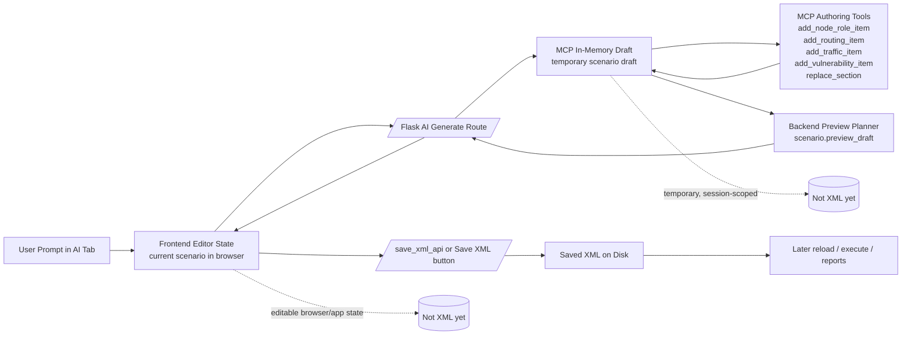

# Feature Deep Dive

## AI Generator workflow
- For a dedicated summary of the recent compiler, retry, validation, and preview-sync improvements, see [AI Generator Workflow](AI_GENERATOR_WORKFLOW.md).
- The AI Generator tab sends the current in-browser scenario state, the user prompt, the selected Ollama model/base URL, and the enabled MCP tools to the Flask AI generation route.
- Before model-authored rows are trusted, the backend runs a deterministic intent compiler in `scenarioforge/planning/ai_topology_intent.py`.
- That compiler currently owns explicit prompt intent for `Node Information`, `Routing`, `Services`, `Traffic`, `Vulnerabilities`, and `Segmentation`.
- The compiler emits two things from the same prompt: backend-compatible section payloads and MCP seed operations. Both the direct JSON path and the MCP bridge path use that same compiled intent so they do not drift.
- Practical rule: the model should supply missing details around the seeded template, but explicit counts and concrete section requests for compiler-managed sections are backend-authored, not free-form LLM-authored.
- In MCP mode, Ollama does not write XML directly. The backend opens the repo-local MCP server and creates an in-memory draft from the current scenario.
- Ollama then uses narrow `scenario.*` tools to mutate that draft. Typical tools are:
	- `scenario.get_authoring_schema`: fetch valid backend-supported section values and defaults.
	- `scenario.add_node_role_item`: add host rows under Node Information.
	- `scenario.add_routing_item`: add router rows and routing edge hints.
	- `scenario.add_service_item`: add Services rows.
	- `scenario.add_traffic_item`: add Traffic rows.
	- `scenario.search_vulnerability_catalog` and `scenario.add_vulnerability_item`: select and add vulnerability rows.
	- `scenario.replace_section`: replace an entire section with a backend-compatible payload.
	- `scenario.preview_draft`: run the backend preview planner on the current draft.
	- `scenario.save_xml`: persist the current draft to XML when explicitly needed.
- Those MCP tools execute repo/backend logic, not free-form model logic. The model chooses the tool calls, but the actual mutations and validation happen inside the backend.
- After direct JSON generation, the backend reapplies the compiled intent before preview so explicit compiler-managed sections cannot be silently overridden by malformed model rows.
- The preview shown after generation comes from the backend planner, not from the model. The planner computes routers, hosts, switches, flow metadata, and other derived state from the current in-memory draft.
- After a successful AI generation, the frontend replaces the current scenario/editor state with the generated scenario and stores the preview metadata in browser/app state. This still does not write XML by itself.
- XML is only written when a save path is used:
	- the normal Save XML button serializes the current editor state through `/save_xml_api`
	- the MCP tool `scenario.save_xml` can also persist the current in-memory draft

### Intent compiler boundary
- `compile_ai_topology_intent(...)` is the boundary between prompt understanding and scenario row authoring.
- Use the compiler for explicit structural asks such as router counts, host-role counts, service counts, traffic protocol/pattern counts, vulnerability counts with enabled-catalog grounding, and segmentation control counts.
- Use the model for what remains fuzzy: notes, non-compiler-managed details, or filling in optional context around a valid seeded scenario.
- `preview_full` remains the final validation authority. The compiler reduces authoring error rates; it does not replace backend preview, canonicalization, or concretization.
- The earlier `Phase1` naming has been removed; use the generalized intent-compiler names in new code and tests.

### Route registration pattern
- Extracted Flask route modules under `webapp/routes/` should register through explicit `register(app, ...)` functions and remain safe to call more than once.
- Shared idempotent registration lives in `webapp/routes/_registration.py`; use it instead of per-module ad hoc guard attributes.
- Internally, a route module may bind handlers directly or register a blueprint, but the external registration surface should stay explicit and idempotent.
- `webapp/app_backend.py` still performs the top-level registration and now logs route-registration failures instead of silently swallowing them.
- This pattern exists to tolerate import-order differences in tests and route-module extraction work without turning setup issues into silent `404` failures.

### State flow

```mermaid
flowchart LR
		U[User Prompt in AI Tab] --> FE[Frontend Editor State\ncurrent scenario in browser]
		FE --> API[/Flask AI Generate Route/]
		API --> MCP[MCP In-Memory Draft\ntemporary scenario draft]
		MCP --> TOOLS[MCP Authoring Tools\nadd_node_role_item\nadd_routing_item\nadd_traffic_item\nadd_vulnerability_item\nreplace_section]
		TOOLS --> MCP
		MCP --> PREVIEW[Backend Preview Planner\nscenario.preview_draft]
		PREVIEW --> API
		API --> FE
		FE --> SAVE[/save_xml_api or Save XML button/]
		SAVE --> XML[Saved XML on Disk]
		XML --> LOAD[Later reload / execute / reports]

		MCP -. temporary, session-scoped .-> X1[(Not XML yet)]
		FE -. editable browser/app state .-> X2[(Not XML yet)]
```

### Persistence rules
- MCP draft: temporary, backend-side, session-scoped working copy.
- Frontend editor state: the currently loaded scenario in the browser after AI generation succeeds.
- Preview data: derived backend output used to validate what the current draft would build.
- Saved XML: only created when a save action happens.
- Practical summary:
	- AI Generate = edit the scenario in memory and preview it.
	- Save XML = persist the current scenario state to disk.

## Planning semantics
- Host planning honours **Base Hosts** (density) and **Count** rows; metadata is written into XML (`base_nodes`, `additive_nodes`, `combined_nodes`, etc.) for round-trip fidelity.
- Router and vulnerability planning capture derived vs explicit counts via `explicit_count`, `derived_count`, and `total_planned`.
- Scenario-level `scenario_total_nodes` summarises planned hosts, routers, and vulnerability targets.
- Parser helpers expose metadata programmatically: `scenarioforge.parsers.planning_metadata.parse_planning_metadata()`.
- Hardware-in-the-Loop plans persist per-scenario preferences (enabled state, interface list, attachment choice). Attachments normalize to `existing_router`, `existing_switch`, `new_router`, or `proxmox_vm`. When interfaces map to Proxmox VMs, the apply flow ensures the selected bridge exists on the node (creating it if needed) and rewrites the CORE/external VM adapters to land on that bridge.

### The plan is what runs

Everything a scenario is made of is decided **before** execute, and execute
realizes those decisions rather than making its own. This is not a nicety: the
plan is what the author reviews, what Flow builds its challenge chain against,
and what "accessible by pivot" places provider nodes for. A scenario that
quietly differs from its plan invalidates all three.

| What | How execute realizes it |
|---|---|
| Routers, hosts, switches, addresses, links | `_try_build_segmented_topology_from_preview` builds straight from `preview['hosts'] / ['routers'] / ['switches_detail']` |
| Services per node | applied from `services_preview` |
| Vulnerabilities per slot | forced onto the planned slots from `vulnerabilities_by_node` |
| Pivot provider nodes | materialised into the plan, then created like any other host |
| Segmentation rules | `plan_and_apply_segmentation(planned_rules=…)` applies the plan's rules; no new policy is drawn |
| Traffic flows | `generate_traffic_scripts(planned_flows=…)` writes the plan's flows; none are drawn |

Segmentation and traffic are the two that needed the most care, because both
planners draw from the **global `random` module** — at a dozen points in
segmentation's case. Re-running either is not "the same plan again" but a
different plan, and no amount of seed management fixes that, because the two
runs reach the planner with different amounts of unrelated randomness behind
them. A live run had the preview walling off three subnets and the same
scenario walling off two entirely different ones.

So each of those planners can now be handed its own earlier output:

- **Segmentation** — every planned rule carries a `script_spec`, everything its
  policy script depends on. Replaying is writing that script and enabling the
  recorded service, which reproduces the plan's policy *and* its scripts byte
  for byte. Only the script's file name carries over from the plan, since the
  run may be on a different host than the preview was.
- **Traffic** — flows fully determine every traffic artifact (`_write_agent_configs`
  draws nothing), so the plan's flow list is written out directly.

Both degrade loudly, never silently. A plan whose rules carry no `script_spec`
(saved before this existed) or whose flow list was truncated for payload size
is refused, execute logs why, and the planner runs as it used to — so the run
succeeds and the mismatch is stated rather than hidden.

#### Settings that shape the policy are plan-time inputs

A setting that only reaches execute arrives after the decisions it was meant to
influence have been made and reviewed. So everything that shapes segmentation
lives on the **Segmentation section**, travels with the scenario, and is read
when the plan is computed:

| Attribute | Default | What it does |
|---|---|---|
| `nat_mode` | `SNAT` | `SNAT` or `MASQUERADE` for NAT rules on routers |
| `include_hosts` | `false` | let hosts, not just routers, carry segmentation |
| `dnat_probability` | `0.0` | chance a generated flow gets a router port-forward |
| `allow_src_subnet_prob` | `0.3` | chance a traffic allow widens to the source subnet |
| `allow_dst_subnet_prob` | `0.3` | chance it widens to the destination subnet |
| `accessible_by_pivot` | `false` | the pivot-access toggle above |

The matching CLI flags (`--nat-mode`, `--seg-include-hosts`, `--dnat-prob`,
`--allow-src-subnet-prob`, `--allow-dst-subnet-prob`,
`--seg-accessible-by-pivot`) still work and now apply **when the plan is
computed**. Each defaults to `None` rather than to its value, so "not passed"
stays distinguishable from "passed the value that happens to be the default" —
without that, a flag could not sensibly override a scenario that sets the
attribute itself. The two switches only ever turn something *on*: omitting
`--seg-include-hosts` is not an instruction to override a scenario that enables
it.

Passing one of these at execute against a plan built without it cannot be
honoured, so execute logs exactly which settings it is ignoring and which values
the plan holds, rather than quietly giving you SNAT when you asked for
MASQUERADE.

`--seg-allow-docker-ports` is deliberately **not** a plan-time setting. It opens
ports belonging to containers, which do not exist until execute, so it stays a
run-time flag; the pass that implements it (`write_allow_rules_for_compose_ports`)
runs after the policy is in place and only adds ACCEPTs.

The two probabilities needed one more change to be meaningful as plan-time
inputs: the per-flow decisions they govern used to come from `random.random()`,
so the plan and the run answered differently for the same flow. `flow_draw`
derives the draw from the flow's own identity (endpoints, protocol, port)
instead, which keeps the probability semantics while making the answer a
property of the flow rather than of when it was asked.

### What a rule blocks: `effect`

`segmentation_summary.json` records the planner's **intent**, and its fields
change meaning with the chain a rule lands on:

| type | chain | emitted iptables | what it actually blocks |
|---|---|---|---|
| `subnet_block` | FORWARD | `-s src -d dst -j DROP` | transit, src to dst |
| `subnet_block` | INPUT | `-s src -j DROP` | **this node only** - `dst` is recorded but never matched |
| `host_block` | FORWARD | `-s a -d b -j DROP` | transit, a to b |
| `host_block` | INPUT | `-s a -d b -j DROP` | this node, a to b |
| `protect_internal` | FORWARD | `! -s net -d net -j DROP` | transit into net |
| `protect_internal` | INPUT | `! -s net -j DROP` | **this node only**, from outside net - and the node need not be in net |

The two bold rows only occur with `include_hosts`, which is why they went
unnoticed. Every consumer re-derived "what does this block" from those fields
and they disagreed - pivot access read every rule as subnet-scoped and built a
provider node in a subnet nothing was protecting.

So each rule now carries a normalized **`effect`**, computed in
`utils/segmentation_effects.py` where the chain, the node and the rule are all
still in hand:

```python
{'scope': 'transit' | 'node',   # FORWARD vs INPUT
 'enforced_by': node_id,
 'blocks': bool,                # False for NAT and CUSTOM, which deny no path
 'protects': '<cidr or ip>',    # what is actually shielded
 'blocks_from': '<cidr or ip>', # what is actually shut out
 'invert_source': bool,         # blocks everything EXCEPT blocks_from
 'default_deny_chain': '<chain>'}
```

What keeps it honest is `effect_from_iptables`, which reads the effect back out
of the emitted command. The two are computed from different things on purpose -
one from the planner's variables, one from the text actually written - and a
property test compares them across every rule the planner can produce, over a
sweep of seeds and both placement modes. An effect that does not describe the
rule that was written is exactly the fault the model exists to prevent, so it is
the one thing worth testing that way.

`walled_off_details` now reads effects: only a **transit** block walls a subnet
off, and a block protecting a single address is skipped for the reason
`host_block` always was - the only node in a `/32` is the blocked host, so the
"pivot" would be an allow straight back into what the rule exists to block.
Plans saved before effects existed still work, falling back to the emitted
command and then to the old fields.

Still to migrate onto effects: `_flow_allowed_by_summary` (which currently
misses host-enforced rules, so no allow rule gets written for a flow they drop),
`verify_flows_allowed` (which invents synthetic `/24` hosts because it never
sees the topology), and `webapp/artifact_checks.py` (which filters on
`"block" in type`, so a `protect_internal` drop is reported as a fault rather
than as configured behaviour).

## Router connectivity & aggregation
- Per-routing-item `r2r_mode` supports `Exact`, `Uniform`, `NonUniform`, and `Min`.
- R2S policies (`r2s_mode`, `r2s_edges`, optional `r2s_hosts_min/max`) regroup hosts behind dedicated switches, with “Exact=1” aggregating all hosts per router into a single switch.
- Preview JSON and runtime stats capture router degrees, aggregation counts, and Gini coefficients for quick balance checks.

## Traffic, segmentation, and services
- Traffic scripts land in `/tmp/traffic` (with companion services) and respect overrides for pattern, rate, jitter, and content hints.
- Segmentation scripts land in `/tmp/segmentation` alongside a `segmentation_summary.json`; NAT mode, DNAT probability, host inclusion, and docker port allowances are configurable.
- Both traffic and segmentation are decided at plan time and replayed at execute; see [The plan is what runs](#the-plan-is-what-runs).
- Docker vulnerabilities attach per-node docker-compose files in `/tmp/vulns`; generated services default to `network_mode: none` so CORE owns `eth0` and Docker does not add an unmanaged backend interface. Multi-service Compose networking is an explicit opt-in via `CORETG_COMPOSE_ALLOW_INTERNAL_NETWORKING=1` plus `CORETG_DOCKER_IFID_START=1`.
- Custom traffic plugins can register via `scenarioforge.plugins.traffic.register()` for bespoke sender/receiver code.

### Accessible by pivot

Segmentation under a default-deny policy can wall a subnet off so completely
that nothing inside it is reachable, which makes any challenge placed there
unsolvable. A real scenario hit exactly this: `172.21.240.0/24` was blocked from
two subnets and none of its seven nodes exposed SSH, so the only path through
the boundary was one chain flow scoped to a single source IP.

The **Accessible by pivot** toggle (Segmentation section, or `--seg-accessible-by-pivot`,
or `accessible_by_pivot="true"` on the section element) guarantees every
walled-off subnet keeps one reachable **provider**: a node inside it exposing a
vulnerability, a flag-node-generator, or SSH through the boundary.

Provider selection is hybrid and prefers what already exists:

1. a node already offering a **vulnerability** — the pivot becomes a real challenge step;
2. a node already offering a **flag-node-generator**;
3. a node already running **SSH**;
4. otherwise a **Docker SSH node is added**, built from `PIVOT_SSH_IMAGE`
   (override with `CORETG_PIVOT_SSH_IMAGE`) and reachable on `PIVOT_SSH_PORT`
   (override with `CORETG_PIVOT_SSH_PORT`).

The added provider's port is **2222, not 22**, because the default image is a
rootless sshd. The port follows the image: it is what the allow rule opens and
what the participant connects to, so a site pointing `CORETG_PIVOT_SSH_IMAGE` at
its own mirror sets `CORETG_PIVOT_SSH_PORT` alongside it.

There is deliberately no "turn SSH on for whatever Docker node is already
there" tier. Node images are built offline-safe with **no package manager** —
the wrapper only injects a busybox `ip` — so a minimal image cannot grow an
`sshd`, and enabling the CORE SSH service on it produces an open path to a
closed port. A node that genuinely serves SSH is already tier 3.

**Only Docker-backed nodes are ever eligible.** CORE vnodes — routers, PCs,
servers, workstations — get a network namespace but not a mount namespace, so
they share the CORE VM's filesystem. Handing a participant SSH on one is a host
escape, not a pivot. That excludes the routers too, so a subnet whose hosts are
all unfilled challenge slots has to grow a node rather than borrow the router
already sitting in it.

Step 4 deliberately skips unfilled challenge slots. Consuming one would
silently spend capacity the author allocated for challenges, so **a provider
never counts against configured vulnerability or flag-node-generator slot
counts** — anything placed for pivot access is additive.

**Provider selection happens at plan time**, not at execute time. The topology
is built well before the segmentation phase runs, so a provider that has to be
*added* must be known while nodes are still being planned. `build_full_preview`
therefore computes the plan and publishes it as
`segmentation_preview.pivot_access`, making the requirement — including how many
nodes must be created and from which image — visible before anything is built.

An `added` provider is then **materialised into the same plan**: the node is
allocated an id above every existing node, given a free address inside the
walled-off subnet, linked to that subnet's switch and router, and marked with
the image it must boot. From there it is an ordinary Docker host in the preview
payload and the builder creates it like any other — except that its compose
entry is pinned to the provider image rather than the standard node template,
which serves nothing to pivot through. Its address is what the allow rules then
open, so `pivot_access` reports a `node_id`, a `node_name` and an `address` for
every provider.

The node is allocated **above every existing id** deliberately. Challenge slots
are numbered positionally over the sorted host list, so an id in the middle
would shift every later host's slot and hand a challenge to the wrong node. For
the same reason the provider is excluded from the role counts that produce the
slot range, and from the plan-parity totals execute compares against the XML —
the XML never asked for this node, so counting it would make every
pivot-enabled scenario fail preflight as "does not match".

A later plan over a topology that already carries a provider **reuses that
node** rather than adding a second one: the materialiser leaves a marker on the
node, and `provisioned_entry_points` turns it back into an SSH entry point. Such
a provider keeps reporting as `added: true` — the node exists only because of
this feature, and calling it *reused* would credit the scenario with a node it
never asked for.

That recognition reads the **plan**, never the live CORE session.
`core.api.grpc.wrappers.Session` has no `get_node` on the CORE builds this runs
against, so a lookup keyed on session node names comes back empty and the
provider goes unrecognised — which is exactly how a live run ended up adding a
second provider per subnet. Node names and provider identity therefore come
from the preview payload.

When a provider cannot be placed at all — no switch serves the subnet, or the
subnet has no free address — it is left in `unresolved` with the reason, and
execute logs a WARNING naming the affected subnets rather than letting a
participant discover an unsolvable challenge.

Providers are placed for the subnets the **plan** walls off, so this feature
depends on execute enforcing that same policy rather than drawing a new one —
see [The plan is what runs](#the-plan-is-what-runs). Without it, providers sit
in the subnets the preview blocked while the running scenario blocks others.

**Docker nodes never need the internet at execute time.** CORE starts a Docker
node the moment it is added, so execute resolves every provider image **before
the topology is built**, in this order:

1. **already present** — `docker image inspect` succeeds and nothing is pulled;
2. **pre-seeded tarball** — `<CORETG_PIVOT_IMAGE_CACHE_DIR>/<safe-name>.tar`
   (default `/opt/coretg/images`) is `docker load`ed, so an air-gapped host
   never touches the network. Seed it with
   `docker save <image> -o /opt/coretg/images/<safe-name>.tar`;
3. **pulled once** — only if neither of the above applies.

Once present the image is **cached forever**: it is added to the persistent
keep set, so the execute-time image cleanup cannot reclaim it and force another
download. A pull that fails is logged with the `docker save` command to seed it,
and does not fail the run.

The resulting allow rules are appended to `segmentation_summary.json` tagged
`reason: pivot-access`, so they are distinguishable from the allow rules written
for traffic flows, and a `pivot_access` block records which provider was chosen
for each subnet and how. FORWARD allows are installed on **every** router, not
only the one enforcing the block: segmentation leaves every router with
`-P FORWARD DROP`, so a packet has to survive each hop and the planner cannot
know the route. INPUT lands on the provider, where a default-deny policy would
otherwise drop the packet on arrival.

The toggle is **off by default**, so an existing scenario keeps the exact
segmentation it was authored with.

#### Where the pivot shows up in the chain

Whether a pivot is its own challenge is decided by capability, not by node. If
the challenge already on the provider grants code execution there, solving it
leaves the participant on the node, so pivoting onward is a consequence of work
already done and folds into that step (**absorbed**). A bare SSH box, a router,
or a challenge that only leaks a file or a credential earns a step of its own
(**own_step**).

`CodeExecution(host)` is the test, because the fact subsumption in
`vulns.metadata` already routes every RCE-shaped impact through it, so
`remote_code_execution`, `command_injection`, `deserialization`, `web_rce` and
`privilege_escalation` qualify while `auth_bypass`, `arbitrary_file_read`,
`sql_injection` and `credential_disclosure` do not. One wrinkle compensated for
in `pivot_chain`: `_SUBSUMES` maps the one-argument `Shell(host)` but not
`Shell(host, user)`, which is equally a shell on the host.

Because Flow runs *before* execute, this is decided from the **preview**
topology and preview segmentation rules, not the runtime
`segmentation_summary.json`. The toggle therefore travels with the plan:
orchestrator → `segmentation_preview.accessible_by_pivot` → Flow.

- **Absorbed** pivots stamp `pivot_grants` on the assignment. Flow chain rows
  draw a bold star badge next to the node and the guides add a star plus a row
  naming what solving the step opens.
- **own_step** pivots are rendered as their own row in Flow and their own
  section in the guides, positioned immediately before the first chain step
  inside the subnet they unlock (`insert_before`).

An own_step pivot is deliberately **not** injected into `currentChain`. Chain
nodes and flag assignments are aligned by index throughout the Flow UI and the
exports, and a synthetic step has no generator to resolve, so injecting one
would desynchronise sequencing and break execute. It is a presentation step:
real work for the participant, not a generator to run.

## Reports & artifacts
- Markdown reports (`./reports/scenario_report_<timestamp>.md`) enumerate topology stats, planning metadata, segmentation results, and runtime artefacts. Each run also emits a JSON summary alongside the Markdown file (`scenario_report_<timestamp>.json`) plus per-run connectivity CSVs when router degree data is available.
- Timestamp conventions:
	- Display/readable fields use local time `MM/DD/YY/HH/MM/SS`.
	- Filename/ID-safe values use local time `MM-DD-YY-HH-MM-SS`.
	- Report filenames append microseconds for collision safety: `scenario_report_MM-DD-YY-HH-MM-SS-ffffff.{md,json}`.
- Run history is persisted in `outputs/run_history.json` for the Reports page.
- Safe deletion keeps reports while purging associated outputs under `outputs/` when scenarios are removed via the GUI.
- The Reports page **Downloads** menu also produces a **Solutions Script** (`.sh`) — see below.

## Solutions Script
A downloadable, self-checking bash script generated from the resolved Attack Flow chain. Use it to confirm a deployed scenario is actually solvable, rather than only structurally correct.

- Download it from the Reports page **Downloads** dropdown ("Solutions Script (sh)"), alongside the participant and facilitator guides.
- For each step it establishes the documented entry point, retrieves the step's flag, and reports **PASS / FAIL / INCONCLUSIVE / SKIP** with reasoning, plus a summary line and a nonzero exit when anything fails.
- Reachability: it runs directly when the host routes to the CORE node subnet, or tunnels every command through the CORE VM with `--ssh-host/--ssh-user/--ssh-key/--ssh-port`. Use `-v` to see raw command output.
- Scope: **flag-node-generators only**. Vulnerability and flag-generator steps are emitted as `SKIP` with their reason, because they do not yet ship machine-runnable `access_instructions`.
- Entry points it automates: SSH (password and key based), HTTP/HTTPS (including header- or query-gated steps that must present a prior step's `Checksum`/`Ticket` fact, and basic-auth WebDAV), raw TCP protocol dialogs, and NFS mounts.
- The generated script does not replay the human `access_instructions` verbatim — those are written for people and include interactive prompts and host-side paths. Instead it detects each step's entry tool, derives a deterministic retrieval from the resolved artifacts, and asserts the known `Flag(flag_id)` value. The documented steps are preserved as comments for context.

## Artifact checks (live session validation)
Verifies that a **running** CORE session matches what the scenario said it should be. Available as a per-session icon button in the CORE page **Active sessions** card, and as the `check-artifacts` CLI phase.

Seven ordered checks, each reported as `pass`, `warn`, `fail`, `error`, or `skip`:

1. Containers running on the correct nodes.
2. Services running.
3. Service ports open and reachable across the CORE network.
4. Inject files placed in the right location.
5. Firewall/segmentation rules in place.
6. Traffic scripts running where they should be.
7. Each traffic source reaching its destination, tested on the flow's own protocol and port.

Implementation notes:

- Checks 1-4 reuse the post-execution validator that backs `--post-execution-validation`.
- Checks 5-7 are live probes run on the CORE VM over SSH. Docker-backed nodes are reached with `docker exec`; namespaced CORE vnodes (routers, PCs) with `vcmd -c /tmp/pycore.<session>/<node>`.
- Port reachability is measured **across the CORE network**, because VM-mode nodes publish no host ports. Listening ports are discovered from `/proc/net/tcp[6]`, and loopback-only binds (for example Tomcat's AJP on `127.0.0.1`, including the IPv4-mapped `::ffff:127.0.0.1` form) are reported as context rather than probed.
- **Every port is probed from a node that should reach it**, not from one global prober. Each target picks its own vantage point: the source of a traffic flow to that target, else a peer on the target's own subnet, else any node. Probing everything from a single node measures that node's position in the topology — a prober on the far side of a segmentation boundary reports healthy services as unreachable.
- **Drops that a segmentation rule explains are reported as configured behaviour, not warnings.** Each dropped path is matched against the `subnet_block`/`host_block` rules in `segmentation_summary.json` using the prober's and target's addresses; only drops with no matching rule warn. The segmentation probe therefore runs before the ports check reports, even though it is presented as check 5.
- A connection **timeout** means packets are dropped and is reported as a blocked path; a **refused** connection means the port closed between enumeration and probe and is treated as a benign transient.
- **Reachability tests each flow on its own protocol and port, never with ping.** Under a default-deny segmentation policy ICMP is normally not in the allow list, so pinging reports deliberately-permitted flows as broken. For **TCP** a completed handshake also settles the return path: the SYN arrived and the destination's SYN-ACK came back, which a one-way rule or an asymmetric route could not produce, so no separate reverse probe is needed. A **RST** counts as a working path with nothing listening. **UDP** has no handshake, so delivery is not confirmable — the check reports the datagram left without a routing error, and treats an ICMP port-unreachable reply as positive proof it arrived. Ping is used only as a diagnostic after a flow has already failed, to separate "no route at all" from "route fine, this port filtered".
- **UDP delivery is confirmed from the receiving agent's own counters.** The traffic agent labels each flow `<proto>-<src_id>-<dst_id>-<port>-tx|rx` and writes `/tmp/coretg_traffic/stats_<node_id>.json`, so the destination's `-rx` entry measures exactly what landed. Bytes received confirms the flow; **bytes sent with none received is reported as a fault** — the silent failure mode no sender-side test can see. These counters are cumulative since the agent started, so the check answers "has this traffic arrived", not "is it arriving this second"; a flow that ran and later broke still shows its earlier bytes. Bursty and periodic patterns make a short sampling window unreliable, which is why cumulative totals are used rather than a delta.
- The stats path is **per node** because CORE vnodes share the host's `/tmp` (they get a network namespace, not a mount namespace). A fixed filename made every vnode's agent overwrite the previous one's stats, leaving a single file describing whichever node wrote last.
- Segmentation and traffic prefer the runtime artifacts over the scenario XML's declared density, so a scenario that declares traffic but produced no flows reports `skip`, not a false warning. Whether segmentation exists comes from the rules it generated (`/tmp/segmentation/segmentation_summary.json` plus rules read inside the nodes); whether traffic exists comes from `/tmp/traffic/traffic_summary.json`.
- `allow_verification.json` is a separate signal, not a measure of enforcement: `verify_flows_allowed` writes it to confirm every traffic flow is *permitted*, so its `blocked` list names traffic that segmentation is wrongly blocking. An empty list is healthy; a non-empty one fails the check because that traffic cannot arrive.
- `skip` is a normal outcome meaning the scenario never configured that feature.
- The Web UI runs the checks in a background job with polled progress; result sections are collapsible and scrollable.

## Generator packs & manifests
- The Web UI treats **installed generators** as the source of truth: it discovers generators from `manifest.yaml`/`manifest.yml` under `outputs/installed_generators/`.
- Installed generators are managed as **Generator Packs** (ZIP files). You can upload/import packs from the Flag Catalog page.
- The repo does not ship a starter generator catalog; curated catalogs are imported or exported as ZIP bundles.
- Disable semantics:
	- Packs and individual generators can be disabled.
	- Disabled generators are hidden from Flow substitution and are rejected at preview/execute time.

## Flag sequencing (Flow) highlights
- Initial/Goal facts steer sequencing (flag facts are filtered out); synthesized inputs like `seed`, `node_name`, and `flag_prefix` are treated as known inputs.
- Sequencing uses goal-aware scoring with pruning/backtracking (bounded by a 30s timeout) to find feasible generator assignments.
- Attack Flow Builder export is the native `.afb` format (OpenChart DiagramViewExport).
- The Flow UI marks required inputs with `*` based on manifest inputs (`required: true`) and artifact `requires` (optional artifacts live in `optional_requires`).
- Goal Facts list shows per-variable source badges (e.g., `Seq I`) derived from the chain assignments.
- If a chain length exceeds unique eligible generators, the UI prompts to allow generator reuse; declining clears the chain.

## Vulnerability catalog packs
- The Web UI exposes a **Vuln-Catalog** page that mirrors the Flag Catalog pack UX.
- You can upload/import a ZIP containing directories/subdirectories.
	- Any directory that contains a `docker-compose.yml` is treated as a valid vulnerability template.
	- All other files in those directories are preserved.
	- The UI provides a per-pack file browser so users can download/view the extracted files.
	- The server generates a `vuln_list_w_url.csv` internally so downstream vulnerability selection/processing remains unchanged.

Vulnerability template testing:
- The Vuln-Catalog page includes a **Test** action per catalog item.
- When provided CORE VM SSH credentials, the test runs *on the CORE VM* and uses the same offline-safe docker preflight steps as scenario execution (build wrapper images, pull pull-only images, create containers with `--no-start`, then start with `--no-build`).
