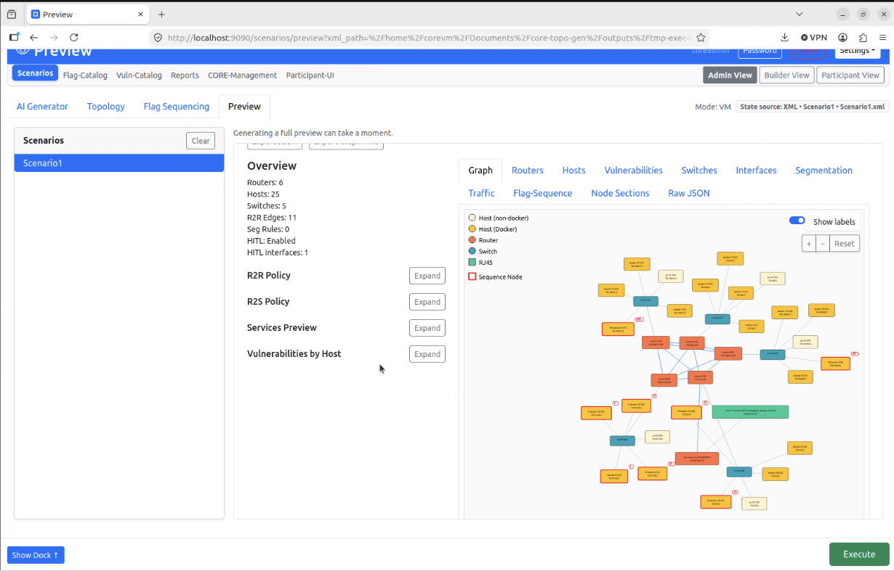
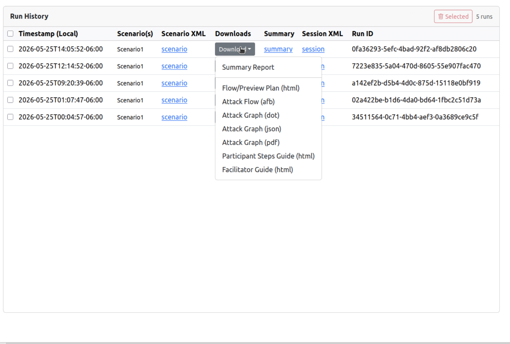
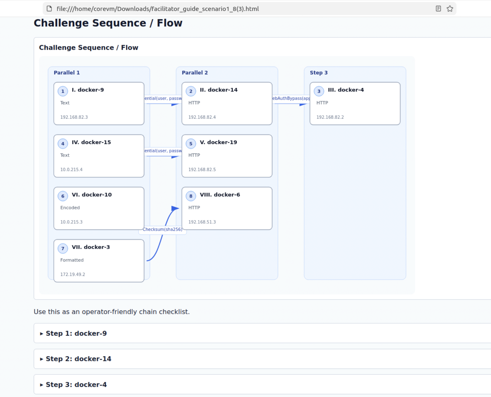

# ScenarioForge Screenshots

Preview the major pages of the Web UI to get a feel for the workflow before running the app.

	
	
<em>Conceptual architecture across frontend, backend, Proxmox, and the CORE VM.</em>

	
	
<em>Flag Sequencing view with generated challenge dependencies.</em>

	
	
<em>Full Preview graph with routers, hosts, switches, vulnerabilities, and HITL details.</em>

	
	
<em>Reports history with downloadable run artifacts.</em>

	
	
<em>Facilitator guide export with the challenge sequence and step checklist.</em>

## Execute retry prompt checklist

When capturing or reviewing screenshots for the Execute retry flow, verify these UI states:

- Execute confirmation is shown before launch.
- Run fails due to active session(s) and shows the prompt title: `Active CORE session(s) blocked this run`.
- Prompt includes a clear confirm action: `Retry with cleanup`.
- After confirm, a new run is launched (new run id in logs/progress) instead of staying on the failed run.
- Retry happens once (no infinite prompt/retry loop).
