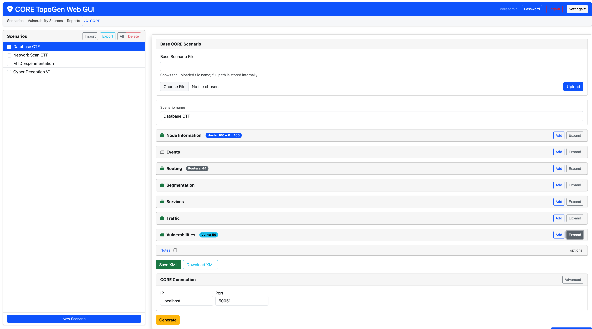
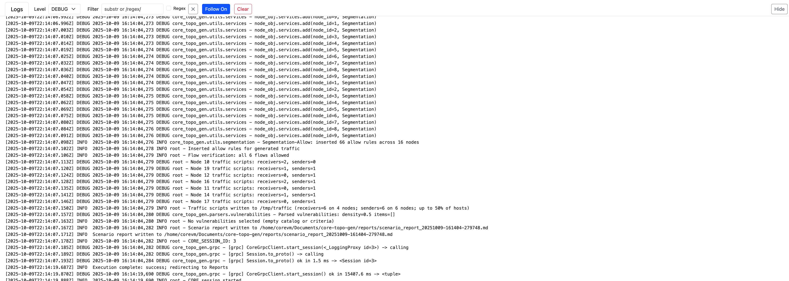
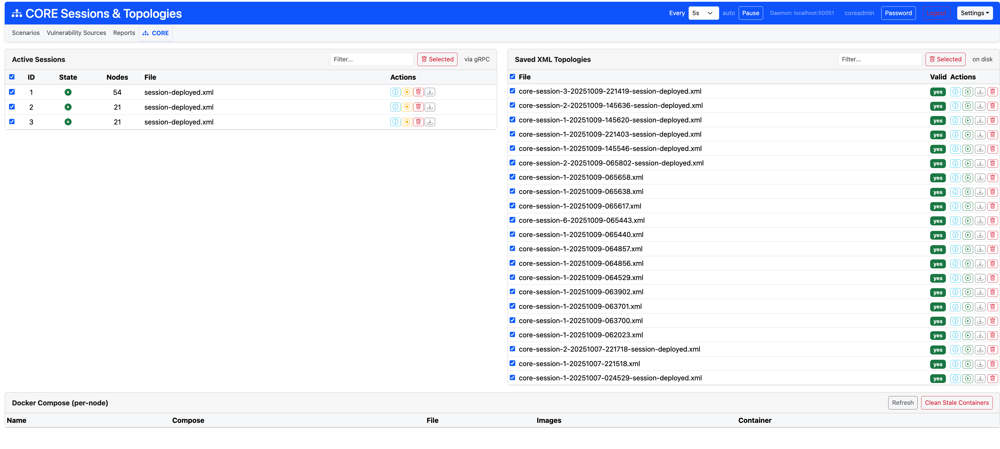
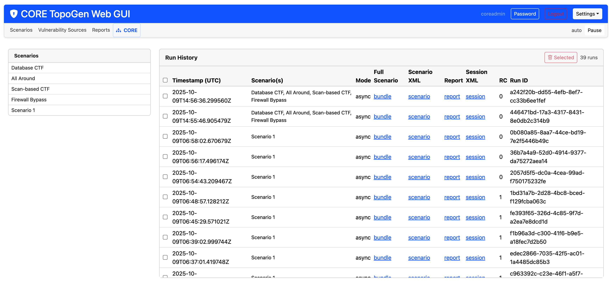

# ScenarioForge Screenshots

Preview the major pages of the Web UI to get a feel for the workflow before running the app.

	
	
<em>Scenario dashboard with Full Preview summary, seed badge, and log dock.</em>

	
	
<em>Logs tab showing level/filter controls and the Follow toggle.</em>

	
	
<em>Full Preview modal: counts, segmentation summary, graph layout, and quick actions.</em>

	
	
<em>CORE sessions page lists active sessions, available topologies, and safe actions.</em>

	
	
<em>Reports page summarises recent runs with quick filters and Markdown download links.</em>

## Execute retry prompt checklist

When capturing or reviewing screenshots for the Execute retry flow, verify these UI states:

- Execute confirmation is shown before launch.
- Run fails due to active session(s) and shows the prompt title: `Active CORE session(s) blocked this run`.
- Prompt includes a clear confirm action: `Retry with cleanup`.
- After confirm, a new run is launched (new run id in logs/progress) instead of staying on the failed run.
- Retry happens once (no infinite prompt/retry loop).
